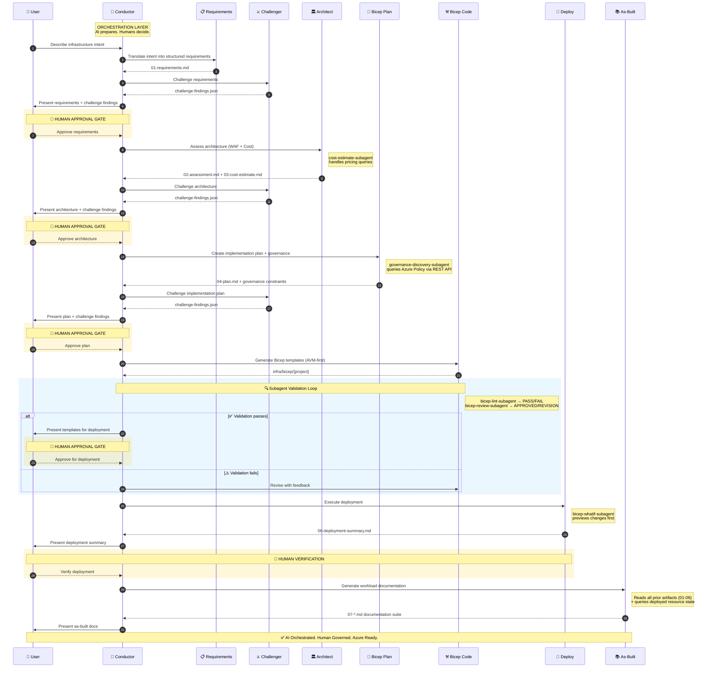

<!-- markdownlint-disable MD013 MD033 MD041 -->

<a id="readme-top"></a>

[![Contributors][contributors-shield]][contributors-url]
[![Forks][forks-shield]][forks-url]
[![Stargazers][stars-shield]][stars-url]
[![Issues][issues-shield]][issues-url]
[![MIT License][license-shield]][license-url]
[![Azure][azure-shield]][azure-url]

<div align="center">
  
</div>

<br />
<div align="center">
  <a href="https://github.com/jonathan-vella/azure-agentic-infraops">
    
  </a>

  <h1 align="center">Agentic InfraOps</h1>

  <p align="center">
    <strong>A multi-agent orchestration system for Azure infrastructure development</strong>
    <br />
    <em>Requirements → Architecture → Plan → Code → Deploy → Documentation</em>
    <br /><br />
    <a href="#-quick-start"><strong>Quick Start »</strong></a>
    ·
    <a href="agent-output/">Sample Outputs</a>
    ·
    <a href="docs/prompt-guide/">Prompt Guide</a>
    ·
    <a href="https://github.com/jonathan-vella/azure-agentic-infraops/issues/new?labels=bug">Report Bug</a>
  </p>
</div>

---

Agentic InfraOps coordinates specialized AI agents through a complete infrastructure development
cycle. Instead of context-switching between requirements, architecture decisions, Bicep authoring,
and documentation, you get a **structured 7-step workflow** with built-in WAF alignment, AVM-first
code generation, and mandatory human approval gates.

---

## Agentic Workflow



<p align="right">(<a href="#readme-top">back to top</a>)</p>

---

## ⚡ Quick Start

**Prerequisites:** Docker Desktop (or Podman/Rancher), VS Code with Dev Containers, GitHub Copilot.

```bash
git clone https://github.com/jonathan-vella/azure-agentic-infraops.git
cd azure-agentic-infraops
code .
```

1. Press `F1` → **Dev Containers: Reopen in Container** _(first build: ~2-3 min, all tools pre-installed)_
2. Enable the required VS Code setting:
   ```json
   { "chat.customAgentInSubagent.enabled": true }
   ```
3. Press `Ctrl+Shift+I` → select **InfraOps Conductor** → describe your infrastructure

```text
Create a web app with Azure App Service, Key Vault, and SQL Database
```

The Conductor guides you through all 7 steps with approval gates.

📖 **[Full Quick Start Guide →](docs/quickstart.md)**

<p align="right">(<a href="#readme-top">back to top</a>)</p>

---

## Agents

<details>
<summary>View full agent roster</summary>

### Conductor

| Agent                  | Role                                      |
| ---------------------- | ----------------------------------------- |
| **InfraOps Conductor** | Master orchestrator — manages all 7 steps |

### Core Agents

| Step | Agent          | Role                                            |
| ---- | -------------- | ----------------------------------------------- |
| 1    | `requirements` | Captures functional, NFR, and compliance needs  |
| 2    | `architect`    | WAF assessment, design decisions, cost estimate |
| 3    | `design`       | Architecture diagrams and ADRs (optional)       |
| 4    | `bicep-plan`   | Implementation planning with governance         |
| 5    | `bicep-code`   | AVM-first Bicep template generation             |
| 6    | `deploy`       | Azure resource provisioning                     |
| 7    | `as-built`     | As-built documentation suite                    |

### Subagents

| Subagent                        | Role                                          |
| ------------------------------- | --------------------------------------------- |
| `cost-estimate-subagent`        | Azure Pricing MCP queries                     |
| `governance-discovery-subagent` | Azure Policy REST API discovery               |
| `bicep-lint-subagent`           | Syntax validation (bicep lint, bicep build)   |
| `bicep-review-subagent`         | Code review (AVM standards, security, naming) |
| `bicep-whatif-subagent`         | Deployment preview (az deployment what-if)    |

### Standalone Agents

| Agent        | Role                                                                                    |
| ------------ | --------------------------------------------------------------------------------------- |
| `challenger` | Adversarial reviewer — challenges requirements, architecture, and plans for blind spots |
| `diagnose`   | Resource health assessment and troubleshooting                                          |

</details>

<p align="right">(<a href="#readme-top">back to top</a>)</p>

---

## 🧩 MCP Integration

| MCP Server                                                                                        | Purpose                                                 |
| ------------------------------------------------------------------------------------------------- | ------------------------------------------------------- |
| [Azure MCP Server](https://github.com/microsoft/mcp/blob/main/servers/Azure.Mcp.Server/README.md) | 40+ Azure service tools — governance, monitoring, RBAC  |
| [Pricing MCP](mcp/azure-pricing-mcp/)                                                             | Real-time Azure retail pricing for cost-aware decisions |

<p align="right">(<a href="#readme-top">back to top</a>)</p>

---

## Related Repositories

### 🚀 [azure-agentic-infraops-accelerator](https://github.com/jonathan-vella/azure-agentic-infraops-accelerator)

A curated collection of pre-built, production-ready Azure infrastructure patterns generated and
validated by the Agentic InfraOps workflow. Use it as a starting point for common workload
archetypes—each pattern ships with Bicep templates, agent artifacts, and deployment scripts.

### 🎓 [azure-agentic-infraops-workshops](https://github.com/jonathan-vella/azure-agentic-infraops-workshops)

Hands-on workshop material for teams and individuals learning the Agentic InfraOps workflow.
Structured labs walk you through each of the 7 steps with guided exercises, sample prompts, and
reference solutions—from first Conductor run to full deployment.

<p align="right">(<a href="#readme-top">back to top</a>)</p>

---

## 🤝 Contributing & License

Contributions are welcome — see [CONTRIBUTING.md](CONTRIBUTING.md) for guidelines.
MIT License — see [LICENSE](LICENSE) for details.

Built upon [copilot-orchestra](https://github.com/ShepAlderson/copilot-orchestra) and
[Github-Copilot-Atlas](https://github.com/bigguy345/Github-Copilot-Atlas).

---

<div align="center">
  <p>Made with ❤️ by <a href="https://github.com/jonathan-vella">Jonathan Vella</a></p>
</div>

<!-- MARKDOWN LINKS & IMAGES -->

[contributors-shield]: https://img.shields.io/github/contributors/jonathan-vella/azure-agentic-infraops.svg?style=for-the-badge
[contributors-url]: https://github.com/jonathan-vella/azure-agentic-infraops/graphs/contributors
[forks-shield]: https://img.shields.io/github/forks/jonathan-vella/azure-agentic-infraops.svg?style=for-the-badge
[forks-url]: https://github.com/jonathan-vella/azure-agentic-infraops/network/members
[stars-shield]: https://img.shields.io/github/stars/jonathan-vella/azure-agentic-infraops.svg?style=for-the-badge
[stars-url]: https://github.com/jonathan-vella/azure-agentic-infraops/stargazers
[issues-shield]: https://img.shields.io/github/issues/jonathan-vella/azure-agentic-infraops.svg?style=for-the-badge
[issues-url]: https://github.com/jonathan-vella/azure-agentic-infraops/issues
[license-shield]: https://img.shields.io/github/license/jonathan-vella/azure-agentic-infraops.svg?style=for-the-badge
[license-url]: https://github.com/jonathan-vella/azure-agentic-infraops/blob/main/LICENSE
[azure-shield]: https://img.shields.io/badge/Azure-Ready-0078D4?style=for-the-badge&logo=microsoftazure&logoColor=white
[azure-url]: https://azure.microsoft.com
