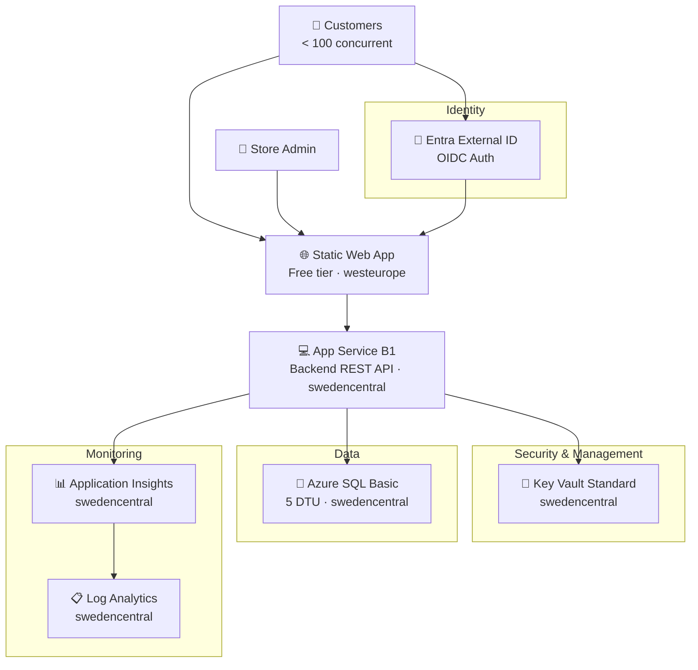

# 🏛️ Step 2: Architecture Assessment - terraform-e2e

<strong>📑 Assessment Contents</strong>

- [✅ Requirements Validation](#-requirements-validation)
- [💎 Executive Summary](#-executive-summary)
- [🏛️ WAF Pillar Assessment](#-waf-pillar-assessment)
- [📦 Resource SKU Recommendations](#-resource-sku-recommendations)
- [🎯 Architecture Decision Summary](#-architecture-decision-summary)
- [🚀 Implementation Handoff](#-implementation-handoff)
- [🔒 Approval Gate](#-approval-gate)
- [References](#references)

> Generated by architect agent | 2025-07-14

| ⬅️ Previous                              | 📑 Index            | Next ➡️                                            |
| ---------------------------------------- | ------------------- | -------------------------------------------------- |
| [01-requirements.md](01-requirements.md) | [README](README.md) | [03-des-cost-estimate.md](03-des-cost-estimate.md) |

## ✅ Requirements Validation

| Requirement Area        | Status    | Validation Notes                                                                    |
| ----------------------- | --------- | ----------------------------------------------------------------------------------- |
| NFRs (SLA, RTO, RPO)    | ✅ Defined | SLA 99.5%, RTO 24h, RPO 12h — relaxed for dev-only, achievable with single region |
| Compliance requirements | ✅ Defined | GDPR applicable with 7 controls; PCI-DSS/SOC2/HIPAA/ISO not required              |
| Budget (approximate)    | ✅ Defined | $500–$2,000/month soft limit; estimated actual ~$75–$150                           |
| Scale requirements      | ✅ Defined | <100 concurrent users, <50 txn/day, scale-out triggers documented                 |
| Security controls       | ✅ Defined | Managed Identity, Key Vault, TLS 1.2, AES-256; public endpoints OK for dev        |
| Data residency          | ✅ Defined | EU-only in swedencentral; GDPR data residency requirements met                     |

> [!NOTE]
> All requirement areas fully defined. Challenger review completed at Step 1 with 7 findings
> addressed. Network security has a governance validation gate — must check against
> `04-governance-constraints.json` before finalizing.

---

## 💎 Executive Summary

This is a **small ecommerce storefront** for a startup with <100 concurrent users,
deployed to Azure as a dev-only environment using Terraform IaC. The architecture
follows a **Cost-Optimized N-Tier** pattern: Static Web App (frontend) → App Service
(backend API) → Azure SQL (data store), with Microsoft Entra External ID for customer
authentication.

The primary optimization pillar is **Cost** — all SKUs target the lowest viable tier
while maintaining the 99.5% SLA target. Security is adequate for dev but would need
private endpoints, WAF, and network isolation before promoting to production. Reliability
is deliberately relaxed (RTO 24h, RPO 12h) given the single-region, dev-only posture.

### Recommended Architecture

### Terraform-Specific Notes

- **State management**: Remote state in Azure Blob Storage backend with state locking
- **Provider**: `azurerm ~> 4.0` with `hashicorp/random` for unique suffixes
- **AVM-TF modules**: Available for App Service, SQL Server, Key Vault, Log Analytics, App Insights
- **Static Web App**: No AVM-TF module confirmed — may require raw `azurerm_static_web_app` resource
- **Unique suffix**: `random_string` (4 chars, lowercase) replaces Bicep's `uniqueString()`

---

## 🏛️ WAF Pillar Assessment

### Overall Scores

| Pillar                    | Score | Confidence | Summary                                                          |
| ------------------------- | ----- | ---------- | ---------------------------------------------------------------- |
| 🔒 Security               | 6/10  | Medium     | Adequate for dev; lacks network isolation and WAF                |
| 🔄 Reliability            | 5/10  | High       | Single region, no failover, relaxed RTO/RPO — acceptable for dev |
| ⚡ Performance            | 7/10  | Medium     | B1 + SQL Basic sufficient for <100 users; no caching layer      |
| 💰 Cost Optimization      | 9/10  | High       | Free/Basic SKUs throughout; well under budget envelope           |
| 🔧 Operational Excellence | 6/10  | Medium     | Terraform IaC + monitoring; lacks CI/CD and automated runbooks   |

**Primary Pillar Optimized**: 💰 Cost Optimization
**Trade-offs Accepted**: Relaxed reliability (single region, no failover) and security (public endpoints, no WAF) in exchange for minimal cost in dev environment

---

### 🔒 Security Assessment (6/10)

**Strengths:**

- Managed Identity for App Service → Azure SQL connectivity (no credentials in code)
- Key Vault Standard for centralized secret management
- TLS 1.2 enforced on all services; AES-256 encryption at rest
- Microsoft Entra External ID for customer OIDC authentication
- Admin MFA required for Store Admin and Platform Engineer roles
- GDPR controls defined and mapped to Azure features (see table below)

**GDPR Control → Azure Feature Mapping:**

| GDPR Requirement             | Azure Feature / Implementation                                                               | Status       |
| ---------------------------- | -------------------------------------------------------------------------------------------- | ------------ |
| EU data subjects             | All resources deployed to `swedencentral` (EU); Entra External ID for EU customer OIDC       | ✅ Addressed |
| Data residency               | Azure SQL + Key Vault + Storage in `swedencentral`; SWA in `westeurope` — both EU regions    | ✅ Addressed |
| Right to erasure             | Application-layer API endpoint to delete customer records from Azure SQL + purge from backups | ⚠️ App-layer |
| Right to data portability    | Application-layer API endpoint to export customer data in JSON/CSV from Azure SQL             | ⚠️ App-layer |
| Lawful basis documentation   | Entra External ID consent flows for marketing; order processing under contractual basis       | ⚠️ App-layer |
| Breach notification (72 hrs) | Azure Monitor alerts → Action Group (email/SMS) pipeline; Defender for Cloud (when enabled)   | ✅ Addressed |
| Data retention governance    | Azure SQL soft-delete + scheduled purge jobs (3 yr customer / 7 yr orders); Log Analytics 30d | ⚠️ App-layer |

> **Legend**: ✅ Addressed = infrastructure-level control; ⚠️ App-layer = requires application code implementation in addition to infrastructure

**Gaps:**

- No private endpoints — all services use public endpoints (accepted for dev)
- No Web Application Firewall (WAF) — low traffic does not justify cost in dev
- No DDoS Protection Standard — Basic DDoS included with Azure platform
- No network isolation (VNet integration or NSGs for App Service)
- No threat detection or Microsoft Defender for Cloud

**Recommendations:**

1. **Before production**: Enable private endpoints for SQL and Key Vault; add VNet integration for App Service
2. **Before production**: Deploy Azure Front Door with WAF policy or App Gateway WAF v2
3. Enable Microsoft Defender for Cloud (Free tier) for security posture visibility
4. Configure Azure SQL auditing and threat detection (included at no extra cost)
5. Validate network controls against subscription governance policies in Step 4

### 🔄 Reliability Assessment (5/10)

**Composite SLA Calculation:**

| Service              | Published SLA | Tier / Notes                                        |
| -------------------- | ------------- | --------------------------------------------------- |
| Azure Static Web App | 99.95%        | Free tier SLA same as Standard (global CDN)         |
| App Service B1       | 99.95%        | Basic tier and above                                |
| Azure SQL Basic      | 99.99%        | Single database, all tiers                          |
| Key Vault Standard   | 99.99%        | All tiers                                           |
| Entra External ID    | 99.99%        | Global SaaS (identity platform SLA)                 |
| Application Insights | 99.9%         | Data ingestion & query availability                 |

These services are in a **serial dependency chain** (SWA → App Service → SQL), so the composite SLA is the product:

$$SLA_{composite} = 0.9995 \times 0.9995 \times 0.9999 \times 0.9999 \times 0.9999 \times 0.999 = 0.9977 \approx 99.77\%$$

> **Result**: Composite SLA **99.77%** exceeds the 99.5% target with a **0.27% margin**.
> Annual downtime budget: ~19.3 hours (target allows ~43.8 hours).

**Strengths:**

- Composite SLA 99.77% exceeds the 99.5% target requirement
- Azure SQL Basic includes automatic PITR (Point-In-Time Restore) with 5-minute granularity and 7-day retention
- Static Web App provides built-in global CDN and edge availability
- Infrastructure defined as code (Terraform) enables repeatable rebuilds
- Scale-out triggers documented with clear thresholds

**Gaps:**

- Single region deployment — no geo-redundancy or failover region configured
- No Availability Zones leveraged (B1 App Service Plan does not support AZ)
- No automated health probes or self-healing beyond Azure platform defaults
- RTO 24h depends on manual intervention (Terraform re-apply from scratch)
- SQL Basic tier offers no zone redundancy or read replicas

**Recommendations:**

1. Accept current posture for dev-only — RTO 24h and RPO 12h are achievable
2. **Before production**: Upgrade to P1v4 App Service Plan to enable Availability Zones (S1 does not support AZ)
3. **Before production**: Enable Azure SQL geo-replication to `germanywestcentral`
4. Configure App Service health check endpoint for automatic instance recycling
5. Document manual recovery procedure (Terraform plan + apply) as interim DR plan

### ⚡ Performance Assessment (7/10)

**Strengths:**

- Static Web App serves frontend from global CDN edge — sub-second delivery for static assets
- App Service B1 (1 vCPU, 1.75 GB RAM) adequate for <100 concurrent users and <50 txn/day
- Azure SQL Basic (5 DTU) sufficient for lightweight CRUD operations on <2 GB data
- Application Insights enables end-to-end tracing for latency identification

**Gaps:**

- No caching layer (Azure Cache for Redis) — all API requests hit SQL directly
- App Service B1 is single-instance, no autoscaling capability
- B1 plan has limited CPU/memory — sustained load above 80 users may degrade performance
- No CDN or Front Door for API acceleration (backend is single-region)

**Recommendations:**

1. Monitor API p95 latency via Application Insights; target <500ms is achievable at current scale
2. **At 80 concurrent users**: Evaluate App Service scale-out (upgrade to S1 for autoscale support)
3. **At 500+ users**: Add Azure Cache for Redis (Basic C0) for session state and frequent queries
4. Configure Application Insights availability tests to measure end-user page load times

### 💰 Cost Assessment (9/10)

| Service                  | SKU           | Monthly Cost | Notes                                |
| ------------------------ | ------------- | -----------: | ------------------------------------ |
| Azure Static Web Apps    | Free          |        $0.00 | Free tier — no cost                  |
| Azure App Service        | B1 (Linux)    |       $13.14 | MCP confirmed (swedencentral)        |
| Azure SQL Database       | Basic (5 DTU) |  $5.00–$15.00| MCP unresolved — requirements range  |
| Key Vault                | Standard      |       <$1.00 | ~1000 ops/mo at $0.03/10K ops        |
| Application Insights     | Pay-per-GB    | $5.00–$30.00 | ~0.5 GB/day; first 5 GB/mo free      |
| Log Analytics            | Per GB        |     included | Bundled with App Insights workspace  |
| Entra External ID        | Free tier     |        $0.00 | First 50K MAU free; <100 users       |
| **Total Estimated**      |               |**~$25–$60/mo**| Well within $500–$2K budget          |

> [!WARNING]
> **MCP Pricing Confidence: Medium** — App Service B1 price confirmed by `azure_bulk_estimate`.
> SQL Database Basic, Application Insights, and Log Analytics were unresolved by MCP tools
> (SKU name mismatches). Ranges shown are from requirements component guardrails.
> Key Vault returned incorrect meter ($2,190 — wrong SKU mapping). Actual Key Vault
> cost for 1000 operations/month is negligible (<$1).

**Cost Optimization Applied:**

- Free tier selected for Static Web Apps and Entra External ID (within free limits)
- Basic/B1 SKUs selected for compute and database — lowest viable tiers
- Pay-per-GB monitoring with first 5 GB free reduces monitoring costs
- No reserved instances needed at this scale and commitment level
- Consumption-based model preferred per requirements

### 🔧 Operational Excellence Assessment (6/10)

**Strengths:**

- Terraform IaC ensures reproducible, version-controlled infrastructure
- Application Insights + Log Analytics provide observability across all deployed resources
- Diagnostic settings enabled for audit logging
- Alert MTTA target <30 minutes achievable with email notifications
- 100% monitoring coverage target with App Insights auto-instrumentation

**Gaps:**

- No CI/CD pipeline defined (manual Terraform apply)
- No automated testing (infrastructure or application)
- No operations runbooks or playbooks documented
- No automated alerting rules configured yet (will be defined in Step 4/5)
- Maintenance windows defined but not enforced via Azure Maintenance Configurations

**Recommendations:**

1. Configure GitHub Actions workflow for Terraform plan/apply (can be deferred to post-MVP)
2. Set up basic alert rules: SQL DTU >80%, App Service CPU >80%, HTTP 5xx errors >1%
3. Document manual operations procedures: scale-out, backup restore, incident response
4. Enable Azure Monitor action groups for email notifications to team-terraform

### Service Maturity Assessment

| Service               | GA Status | AVM-TF Module Available | Deprecation Risk |
| --------------------- | --------- | ----------------------- | ---------------- |
| Azure Static Web Apps | GA        | ⚠️ Not confirmed        | 🟢 Low           |
| Azure App Service     | GA        | ✅ Yes                  | 🟢 Low           |
| Azure SQL Database    | GA        | ✅ Yes                  | 🟢 Low           |
| Key Vault             | GA        | ✅ Yes                  | 🟢 Low           |
| Application Insights  | GA        | ✅ Yes                  | 🟢 Low           |
| Log Analytics         | GA        | ✅ Yes                  | 🟢 Low           |
| Entra External ID     | GA        | N/A (SaaS)             | 🟢 Low           |

> [!NOTE]
> All services are Generally Available with low deprecation risk. Entra External ID
> is the official successor to Azure AD B2C (end-of-sale May 2025). AVM-TF module
> for Static Web Apps should be verified during implementation planning (Step 4).

---

## 📦 Resource SKU Recommendations

| Service               | Recommended SKU  | Configuration                         | Monthly Est.   | Justification                            |
| --------------------- | ---------------- | ------------------------------------- | -------------- | ---------------------------------------- |
| Static Web App        | Free             | westeurope, custom domain not included| $0.00          | Sufficient for dev; 100 GB bandwidth     |
| App Service Plan      | B1 (Linux)       | swedencentral, 1 vCPU, 1.75 GB RAM   | $13.14         | Minimum for always-on API workload       |
| Azure SQL Database    | Basic (5 DTU)    | swedencentral, 2 GB max size          | ~$5–$15        | Adequate for <50 txn/day, <2 GB data     |
| Key Vault             | Standard         | swedencentral, RBAC authorization     | <$1            | Centralized secrets; minimal operations  |
| Application Insights  | Pay-per-GB       | swedencentral, workspace-based        | ~$5–$30        | End-to-end tracing, ~0.5 GB/day          |
| Log Analytics         | Per GB           | swedencentral, 30-day retention       | included       | Bundled with App Insights workspace      |
| Entra External ID     | Free tier        | Global (SaaS)                         | $0.00          | First 50K MAU free                       |

<strong>Azure App Service</strong> — Pricing Tier Comparison

| Tier     | vCPU | RAM     | Price/mo | Autoscale | AZ Support | Fits?              |
| -------- | ---- | ------- | -------- | --------- | ---------- | ------------------ |
| Free F1  | Shared | 1 GB  | $0       | ❌        | ❌         | ❌ No always-on    |
| Basic B1 | 1    | 1.75 GB | $13.14   | ❌        | ❌         | ✅ Selected        |
| Std S1   | 1    | 1.75 GB | ~$70     | ✅        | ❌         | ⚠️ Over-provisioned |
| Prem P1v3| 2    | 8 GB    | ~$140    | ✅        | ✅         | ⚠️ Prod AZ option   |
| Prem P1v4| 2    | 8 GB    | ~$160    | ✅        | ✅         | ⚠️ Prod AZ (latest) |

**Selected**: B1 — lowest always-on tier; sufficient for <100 users. **Production AZ path**: P1v4 (P1v3 also supports AZ but P1v4 is the latest generation)

<strong>Azure SQL Database</strong> — Pricing Tier Comparison

| Tier     | DTU/vCores | Max Size | Price/mo | Zone Redundant | Fits?              |
| -------- | ---------- | -------- | -------- | -------------- | ------------------ |
| Basic    | 5 DTU      | 2 GB     | ~$5      | ❌             | ✅ Selected        |
| S0       | 10 DTU     | 250 GB   | ~$15     | ❌             | ⚠️ Available headroom |
| S1       | 20 DTU     | 250 GB   | ~$30     | ❌             | ❌ Over-provisioned |
| GP vCore | 2 vCores   | 32 GB    | ~$370    | ✅             | ❌ Excessive        |

**Selected**: Basic (5 DTU) — adequate for <50 txn/day and <2 GB data; upgrade to S0 if DTU consistently >80%

---

## 🎯 Architecture Decision Summary

| Decision                        | Choice                           | Rationale                                                         |
| ------------------------------- | -------------------------------- | ----------------------------------------------------------------- |
| Frontend hosting                | Azure Static Web App (Free)      | Zero cost; built-in CDN; adequate for <100 users                  |
| Backend compute                 | App Service B1 (Linux)           | Lowest always-on tier; supports Managed Identity; Terraform AVM   |
| Database                        | Azure SQL Basic (5 DTU)          | Lowest tier with PITR; sufficient for lightweight CRUD            |
| Identity provider               | Microsoft Entra External ID      | Successor to B2C; free for <50K MAU; OIDC standards               |
| Secret management               | Key Vault Standard               | Centralized; RBAC-authorized; Azure security baseline             |
| Monitoring                      | App Insights + Log Analytics     | End-to-end tracing; workspace-based; pay-per-GB                   |
| IaC tool                        | Terraform (azurerm ~> 4.0)       | User requirement; AVM-TF modules available for most resources     |
| Region (primary)                | swedencentral                    | EU GDPR-compliant; default per azure-defaults skill               |
| Region (SWA)                    | westeurope                       | SWA not available in swedencentral                                |
| Network posture                 | Public endpoints                 | Dev-only; cost-optimized; governance validation gate in Step 4    |
| Disaster recovery               | None (single region)             | RTO 24h achievable via Terraform re-apply; RPO 12h via SQL PITR  |
| Unique naming                   | `random_string` (4 chars)        | Terraform equivalent of Bicep's `uniqueString()`                  |
| State backend                   | Azure Blob Storage               | Remote state with locking; dedicated storage account               |

---

## 🚀 Implementation Handoff

### Ready for terraform-plan

The architecture is approved for implementation with the following key parameters:

| Parameter      | Value                                          |
| -------------- | ---------------------------------------------- |
| Region         | swedencentral (SWA: westeurope)                |
| Environment    | dev                                            |
| Budget         | $500–$2,000/month (estimated: ~$25–$60)        |
| Resource Count | 8 (including state backend storage)            |
| IaC Tool       | Terraform (azurerm ~> 4.0)                     |

### Resources to Provision

| #   | Resource              | SKU / Tier     | Key Config                                 |
| --- | --------------------- | -------------- | ------------------------------------------ |
| 1   | Resource Group        | —              | `rg-terraform-e2e-dev`                     |
| 2   | Static Web App        | Free           | westeurope; frontend hosting               |
| 3   | App Service Plan      | B1 (Linux)     | swedencentral; single instance             |
| 4   | App Service           | —              | swedencentral; Managed Identity enabled    |
| 5   | Azure SQL Server      | —              | swedencentral; AD-only auth                |
| 6   | Azure SQL Database    | Basic (5 DTU)  | swedencentral; 2 GB max; PITR enabled      |
| 7   | Key Vault             | Standard       | swedencentral; RBAC; purge protection      |
| 8   | Log Analytics         | Per GB         | swedencentral; 30-day retention            |
| 9   | Application Insights  | Workspace-based| swedencentral; linked to Log Analytics     |

> [!NOTE]
> Terraform state backend (Storage Account + Container) is a prerequisite resource
> that must be provisioned separately before `terraform init`.

### Security Requirements for Implementation

| Requirement                    | Implementation                                                       |
| ------------------------------ | -------------------------------------------------------------------- |
| Managed Identity               | System-assigned on App Service; SQL role assignment via Terraform     |
| Key Vault RBAC                 | `enableRbacAuthorization: true`; App Service identity gets Secrets Reader |
| TLS 1.2                        | `minimum_tls_version = "1.2"` on all services                       |
| HTTPS only                     | `https_only = true` on App Service                                   |
| SQL AD-only auth               | `azuread_authentication_only = true` on SQL Server                   |
| Encryption at rest             | Platform-managed keys (default) — AES-256                           |
| Required tags                  | `Environment=dev`, `ManagedBy=Terraform`, `Project=terraform-e2e`, `Owner=team-terraform` |

### Monitoring Requirements for Implementation

| Requirement                    | Implementation                                                       |
| ------------------------------ | -------------------------------------------------------------------- |
| Application monitoring         | App Insights connection string injected into App Service app settings|
| Log aggregation                | All diagnostic settings route to Log Analytics workspace             |
| Alert notifications            | Action group with email to team-terraform                            |
| SQL DTU monitoring             | Alert rule: DTU percent > 80% for 5 minutes                         |
| App Service CPU monitoring     | Alert rule: CPU percent > 80% for 5 minutes                         |
| HTTP error monitoring          | Alert rule: HTTP 5xx > 1% of requests                               |

---

## 🔒 Approval Gate

> [!IMPORTANT]
> **🏗️ Architecture Assessment Complete**
>
> | Pillar                    | Score |
> | ------------------------- | ----- |
> | 🔒 Security               | 6/10  |
> | 🔄 Reliability            | 5/10  |
> | ⚡ Performance            | 7/10  |
> | 💰 Cost Optimization      | 9/10  |
> | 🔧 Operational Excellence | 6/10  |
>
> **Composite WAF Score**: 6.6/10
>
> **Estimated Monthly Cost**: ~$25–$60 (within $500–$2,000 budget)
>
> **Confidence Level**: Medium (partial MCP pricing; see cost estimate for details)
>
> **Primary optimization**: Cost — all SKUs at lowest viable tier for dev-only environment
>
> - [x] **Approved** — proceed to terraform-plan
> - Approver: User
> - Date: 2026-02-26
>
> **Challenger findings addressed**: SEC-003 (GDPR mapping added), REL-001 (SLA math added — 99.77% composite), REL-002 (AZ path corrected to P1v4). SEC-001 and SEC-002 deferred to Step 4 governance discovery.

---

## References

> [!NOTE]
> 📚 The following Microsoft Learn resources informed this assessment.

| Topic                       | Link                                                                                                                       |
| --------------------------- | -------------------------------------------------------------------------------------------------------------------------- |
| Well-Architected Framework  | [Overview](https://learn.microsoft.com/azure/well-architected/)                                                            |
| Security Checklist          | [WAF Security](https://learn.microsoft.com/azure/well-architected/security/checklist)                                      |
| Reliability Checklist       | [WAF Reliability](https://learn.microsoft.com/azure/well-architected/reliability/checklist)                                |
| Cost Optimization           | [WAF Cost](https://learn.microsoft.com/azure/well-architected/cost-optimization/checklist)                                 |
| App Service Overview        | [Documentation](https://learn.microsoft.com/azure/app-service/)                                                           |
| Azure SQL Database          | [Documentation](https://learn.microsoft.com/azure/azure-sql/)                                                             |
| Static Web Apps             | [Documentation](https://learn.microsoft.com/azure/static-web-apps/)                                                       |
| Entra External ID           | [Documentation](https://learn.microsoft.com/entra/external-id/)                                                           |
| Key Vault Best Practices    | [Documentation](https://learn.microsoft.com/azure/key-vault/general/best-practices)                                       |
| Managed Identities          | [Overview](https://learn.microsoft.com/entra/identity/managed-identities-azure-resources/overview)                         |
| Terraform AVM               | [Registry](https://registry.terraform.io/modules/Azure)                                                                   |
| Azure Pricing Calculator    | [Calculator](https://azure.microsoft.com/pricing/calculator/)                                                              |

---

_Assessment performed using Azure Well-Architected Framework. Pricing data from Azure Pricing MCP (2025-07-14). App Service B1 confirmed at $13.14/month; other items partially resolved._

---

| ⬅️ [01-requirements.md](01-requirements.md) | 🏠 [Project Index](README.md) | ➡️ [03-des-cost-estimate.md](03-des-cost-estimate.md) |
| ------------------------------------------- | ----------------------------- | ----------------------------------------------------- |

