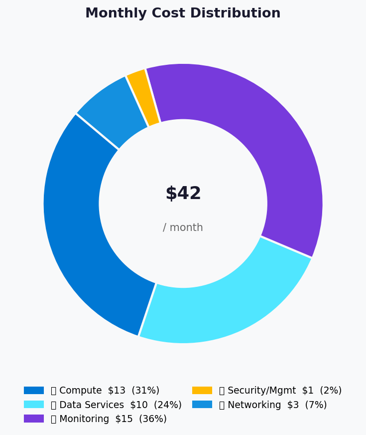
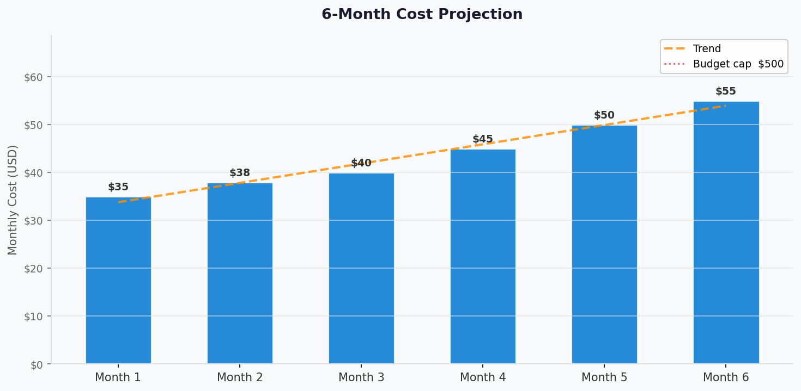

# 💰 Azure Cost Estimate: terraform-e2e


<details open>
<summary><strong>📑 Cost Estimate Contents</strong></summary>

- [💵 Cost At-a-Glance](#-cost-at-a-glance)
- [✅ Decision Summary](#-decision-summary)
- [🔁 Requirements → Cost Mapping](#-requirements--cost-mapping)
- [📊 Top 5 Cost Drivers](#-top-5-cost-drivers)
- [🏛️ Architecture Overview](#-architecture-overview)
- [🧾 What We Are Not Paying For (Yet)](#-what-we-are-not-paying-for-yet)
- [⚠️ Cost Risk Indicators](#-cost-risk-indicators)
- [🎯 Quick Decision Matrix](#-quick-decision-matrix)
- [💰 Savings Opportunities](#-savings-opportunities)
- [🧾 Detailed Cost Breakdown](#-detailed-cost-breakdown)
- [References](#references)

</details>

> Generated by architect agent | 2025-07-14

| ⬅️ Previous                                                    | 📑 Index            | Next ➡️                                                      |
| -------------------------------------------------------------- | ------------------- | ------------------------------------------------------------ |
| [02-architecture-assessment.md](02-architecture-assessment.md) | [README](README.md) | [04-governance-constraints.md](04-governance-constraints.md) |

**Generated**: 2025-07-14
**Region**: swedencentral (SWA: westeurope)
**Environment**: Development
**MCP Tools Used**: azure_bulk_estimate, azure_region_recommend, azure_price_search
**Architecture Reference**: [02-architecture-assessment.md](02-architecture-assessment.md)

## 💵 Cost At-a-Glance

> **Monthly Total: ~$25–$60** | Annual: ~$300–$720
>
> ```text
> Budget: $500–$2,000/month (soft) | Utilization: ~2–12% ($25–$60 of $500–$2,000)
> ```
>
> | Status            | Indicator                                             |
> | ----------------- | ----------------------------------------------------- |
> | Cost Trend        | ➡️ Stable (dev environment, fixed workload)            |
> | Savings Available | 💰 Minimal — already at lowest viable tiers            |
> | Compliance        | ✅ GDPR aligned — swedencentral EU data residency     |

## ✅ Decision Summary

- ✅ Approved: Free/Basic/B1 SKUs across all services for dev-only workload
- ⏳ Deferred: Private endpoints, WAF, Redis cache, multi-region, CI/CD infrastructure
- 🔁 Redesign Trigger: Production promotion requires S1+ App Service (autoscaling), SQL S0+ (capacity), and private networking (+$100–$300/month)

**Confidence**: Medium | **Expected Variance**: ±20% (partial MCP resolution; monitoring costs depend on actual data ingestion volume)

## 🔁 Requirements → Cost Mapping

| Requirement                | Architecture Decision         | Cost Impact       | Mandatory |
| -------------------------- | ----------------------------- | ----------------- | --------- |
| SLA 99.5%                  | Single-region, B1 App Service | Baseline (no add) | Yes       |
| RTO 24h / RPO 12h          | SQL PITR (built-in), no DR    | $0 additional     | Yes       |
| GDPR data residency        | swedencentral region          | +$0 (default)     | Yes       |
| <100 concurrent users      | B1 single instance            | $13.14/mo         | Yes       |
| Centralized secrets        | Key Vault Standard            | <$1/mo            | Yes       |
| Full observability         | App Insights + Log Analytics  | ~$5–$30/mo        | Yes       |
| Customer authentication    | Entra External ID Free        | $0                | Yes       |
| Static frontend            | SWA Free tier                 | $0                | Yes       |

## 📊 Top 5 Cost Drivers

| Rank | Resource              | Monthly Cost    | % of Total | Trend | Optimization                           |
| ---- | --------------------- | --------------- | ---------- | ----- | -------------------------------------- |
| 1️⃣   | App Service B1        | $13.14          | ~40%       | ➡️    | Already lowest always-on tier          |
| 2️⃣   | Application Insights  | ~$5–$30         | ~30%       | ⬆️    | Reduce data ingestion or set daily cap |
| 3️⃣   | Azure SQL Basic       | ~$5–$15         | ~20%       | ➡️    | Already lowest tier                    |
| 4️⃣   | Key Vault Standard    | <$1             | ~2%        | ➡️    | Minimal operations                     |
| 5️⃣   | Data egress           | ~$1–$5          | ~5%        | ➡️    | Minimal for <100 users                 |

> 💡 **Quick Win**: Set Application Insights daily cap to 0.5 GB/day to prevent unexpected monitoring cost spikes.

<details>
<summary><strong>Cost Driver Details</strong></summary>

#### 1️⃣ Azure App Service (B1 Linux)

| Aspect            | Detail                                                |
| ----------------- | ----------------------------------------------------- |
| Current SKU       | B1 (1 vCPU, 1.75 GB RAM, Linux)                      |
| Monthly Cost      | $13.14 (MCP confirmed)                                |
| Cost Breakdown    | Compute: $13.14 (730 hrs × $0.018/hr)                |
| Optimization      | Already at lowest always-on tier; F1 lacks always-on  |
| Potential Savings | None — already cost-optimized                         |

#### 2️⃣ Application Insights + Log Analytics

| Aspect            | Detail                                                |
| ----------------- | ----------------------------------------------------- |
| Current SKU       | Pay-per-GB (workspace-based)                          |
| Monthly Cost      | ~$5–$30 depending on data volume                      |
| Cost Breakdown    | First 5 GB/mo free; ~$2.76/GB after (MCP unresolved) |
| Optimization      | Set daily cap; reduce verbose logging in dev          |
| Potential Savings | ~$10–$20/mo by capping ingestion to 5 GB/mo (free)   |

#### 3️⃣ Azure SQL Database (Basic)

| Aspect            | Detail                                                |
| ----------------- | ----------------------------------------------------- |
| Current SKU       | Basic (5 DTU, 2 GB max)                               |
| Monthly Cost      | ~$5–$15 (MCP unresolved — requirements range)         |
| Optimization      | Already lowest tier with PITR included                |
| Potential Savings | None — already cost-optimized                         |

</details>

## 🏛️ Architecture Overview

### Cost Distribution

| Category             | Monthly Cost (USD) | Share |
| -------------------- | -----------------: | ----: |
| 💻 Compute           |             $13.14 |   40% |
| 💾 Data Services     |        $5.00–$15.00|   20% |
| 📊 Monitoring        |        $5.00–$30.00|   35% |
| 🔐 Security/Mgmt    |              <$1.00|    2% |
| 🌐 Network (egress)  |         $1.00–$5.00|    3% |



### Month-over-Month Projection



> Cost projection assumes stable dev workload with no user growth in months 1-3,
> gradual increase to 100 users in months 4-6. App Insights data volume scales
> proportionally with traffic.

### Key Design Decisions Affecting Cost

| Decision                   | Cost Impact   | Business Rationale                        | Status   |
| -------------------------- | ------------- | ----------------------------------------- | -------- |
| SWA Free (not Standard)    | -$9/mo        | Dev-only; no custom domain/SLA needed     | Required |
| B1 (not S1) App Service    | -$57/mo       | <100 users; no autoscale needed           | Required |
| SQL Basic (not S0)         | -$10/mo       | <50 txn/day; 5 DTU sufficient             | Required |
| No Redis cache             | -$55/mo       | Direct SQL OK for <100 users              | Optional |
| No private endpoints       | -$21/mo       | Dev-only; public endpoints accepted       | Optional |
| Public endpoints only      | -$0           | No VNet/NSG infrastructure cost           | Optional |

## 🧾 What We Are Not Paying For (Yet)

- **Private endpoints** (~$7.30/endpoint × 3 = ~$22/mo) — not needed for dev
- **Azure Cache for Redis** (Basic C0 ~$55/mo) — not needed for <100 users
- **Azure Front Door / WAF** (Standard ~$35/mo + $25/mo WAF policy) — deferred
- **DDoS Protection Standard** (~$2,944/mo) — using platform Basic DDoS
- **Multi-region replication** (SQL geo-replication ~$5–$15/mo) — single region for dev
- **CI/CD infrastructure** (GitHub Actions minutes — free tier for public repos)
- **Microsoft Defender for Cloud** (Free tier available; paid plans from $15/server/mo)

### Assumptions & Uncertainty

- **730 hours/month** assumed for always-on compute resources
- **Data ingestion**: ~0.5 GB/day for App Insights (may be lower in dev with minimal traffic)
- **Network egress**: <5 GB/month for <100 users (charged at ~$0.087/GB after first 100 GB free)
- **Key Vault operations**: ~1000 operations/month (negligible cost)
- **SQL storage**: <2 GB (within Basic tier's 2 GB included limit)
- **MCP pricing gaps**: SQL Database Basic, App Insights, and Log Analytics unresolved by MCP — ranges from requirements guardrails used

## ⚠️ Cost Risk Indicators

| Resource             | Risk Level | Issue                                     | Mitigation                          |
| -------------------- | ---------- | ----------------------------------------- | ----------------------------------- |
| Application Insights | 🟡 Medium  | Data ingestion can spike with verbose logs | Set daily cap to 0.5 GB             |
| Log Analytics        | 🟡 Medium  | Retention beyond 30 days adds cost        | Keep 30-day retention for dev       |
| Azure SQL            | 🟢 Low     | DTU exhaustion forces tier upgrade        | Monitor DTU %; upgrade S0 at 80%    |
| App Service          | 🟢 Low     | CPU exhaustion at high traffic            | Monitor CPU %; scale-out at 80%     |
| Data egress          | 🟢 Low     | First 100 GB/mo free — unlikely to exceed | No action needed                    |

> **⚠️ Watch Item**: Application Insights data ingestion is the primary cost uncertainty — a misconfigured logging level could increase monitoring costs 3–5×.

## 🎯 Quick Decision Matrix

_"If you need X, expect to pay Y more"_

| Requirement               | Additional Cost   | SKU Change           | Verdict        | Notes                              |
| ------------------------- | ----------------- | -------------------- | -------------- | ---------------------------------- |
| 99.99% SLA                | +$60–$140/mo      | S1 App Service + S0 SQL | 🟡 Monitor  | Only if production SLA required    |
| Private Endpoints         | +$22/mo           | 3 endpoints          | 🟡 Monitor     | Required before production         |
| Redis Cache               | +$55/mo           | Basic C0             | 🟡 Monitor     | At 500+ users                      |
| Multi-region DR           | +$20–$50/mo       | SQL geo-replication  | 🔴 Investigate | Only if RTO <4h needed             |
| WAF (Front Door)          | +$60/mo           | FD Standard + WAF    | 🔴 Investigate | Only for production internet-facing|
| Autoscaling               | +$57/mo           | S1 App Service       | 🟡 Monitor     | At 80+ concurrent users            |

## 💰 Savings Opportunities

> ### Total Potential Savings: Minimal
>
> Already at lowest viable tiers. Further savings only possible by:
>
> | Strategy                   | Commitment | Monthly Savings | Annual Savings | % Reduction |
> | -------------------------- | ---------- | --------------- | -------------- | ----------- |
> | App Insights daily cap     | None       | ~$10–$20        | ~$120–$240     | ~30%        |
> | SQL Serverless (if avail.) | None       | ~$3–$5          | ~$36–$60       | ~10%        |
> | Dev/Test Pricing (MSDN)    | MSDN sub   | ~$5–$10         | ~$60–$120      | ~15%        |
> | Free F1 App Service        | None       | $13.14          | $157.68        | 100% compute|
>
> [!NOTE]
> Reserved Instances and Savings Plans are not recommended for this
> dev-only workload due to the small spend and uncertain commitment duration.
> Free F1 App Service drops always-on capability — acceptable only if API
> cold starts are tolerable.

## 🧾 Detailed Cost Breakdown

### Assumptions

- Hours: 730 hours/month (always-on)
- Network egress: <5 GB/month (within free tier)
- Storage: <2 GB SQL (within Basic included)
- App Insights ingestion: ~0.5 GB/day (~15 GB/month; first 5 GB free)

### Line Items

| Category             | Service               | SKU / Meter          | Quantity / Units  | Est. Monthly  | Source            |
| -------------------- | --------------------- | -------------------- | ----------------- | ------------- | ----------------- |
| 💻 Compute           | App Service Plan      | B1 (Linux)           | 1 × 730 hrs      | $13.14        | MCP confirmed     |
| 💻 Compute           | Static Web App        | Free                 | 1                 | $0.00         | Free tier         |
| 💾 Data Services     | Azure SQL Database    | Basic (5 DTU)        | 1                 | ~$5.00–$15.00 | Req. guardrails   |
| 🔐 Security/Mgmt    | Key Vault             | Standard             | ~1000 ops         | <$1.00        | Negligible cost   |
| 📊 Monitoring        | Application Insights  | Pay-per-GB           | ~15 GB/mo         | ~$5.00–$30.00 | Req. guardrails   |
| 📊 Monitoring        | Log Analytics         | Per GB (bundled)     | included          | $0.00         | Bundled with AI   |
| 👤 Identity          | Entra External ID     | Free                 | <100 MAU          | $0.00         | Free tier         |
| 🌐 Networking        | Data egress           | Standard             | <5 GB             | ~$0.00–$5.00  | Mostly free tier  |
|                      | **Total**             |                      |                   | **~$25–$60**  |                   |

### Notes

- **MCP Resolution**: Only App Service B1 ($13.14/mo) was fully confirmed by `azure_bulk_estimate`. SQL Database Basic, App Insights, and Log Analytics returned SKU mismatches. Ranges are conservative estimates from requirements component guardrails.
- **Free tiers**: Static Web Apps Free (100 GB bandwidth, 2 custom domains), Entra External ID (50K MAU), and first 5 GB/month App Insights ingestion provide zero-cost baselines.
- **No reservation eligibility**: At <$60/month total, reserved instances would not provide meaningful savings.
- **Dev/Test pricing**: If team has MSDN/Visual Studio subscriptions, Azure Dev/Test pricing provides additional discounts.
- **Region comparison**: `azure_region_recommend` showed App Service B1 is ≤$0.017/hr in cheaper regions (eastus, westus3) vs $0.018/hr in swedencentral — ~5% difference ($0.73/mo), not worth relocating for GDPR compliance reasons.

---

## References

| Topic                    | Link                                                                                                                   |
| ------------------------ | ---------------------------------------------------------------------------------------------------------------------- |
| Azure Pricing Calculator | [Calculator](https://azure.microsoft.com/pricing/calculator/)                                                          |
| Cost Management          | [Overview](https://learn.microsoft.com/azure/cost-management-billing/costs/overview-cost-management)                   |
| Reserved Instances       | [Reservations](https://learn.microsoft.com/azure/cost-management-billing/reservations/save-compute-costs-reservations) |
| WAF Cost Optimization    | [Checklist](https://learn.microsoft.com/azure/well-architected/cost-optimization/checklist)                            |
| App Service Pricing      | [Pricing](https://azure.microsoft.com/pricing/details/app-service/)                                                   |
| SQL Database Pricing     | [Pricing](https://azure.microsoft.com/pricing/details/azure-sql-database/)                                            |
| App Insights Pricing     | [Pricing](https://azure.microsoft.com/pricing/details/monitor/)                                                        |

---

<div align="center">

| ⬅️ [02-architecture-assessment.md](02-architecture-assessment.md) | 🏠 [Project Index](README.md) | ➡️ [04-governance-constraints.md](04-governance-constraints.md) |
| ----------------------------------------------------------------- | ----------------------------- | --------------------------------------------------------------- |

</div>
