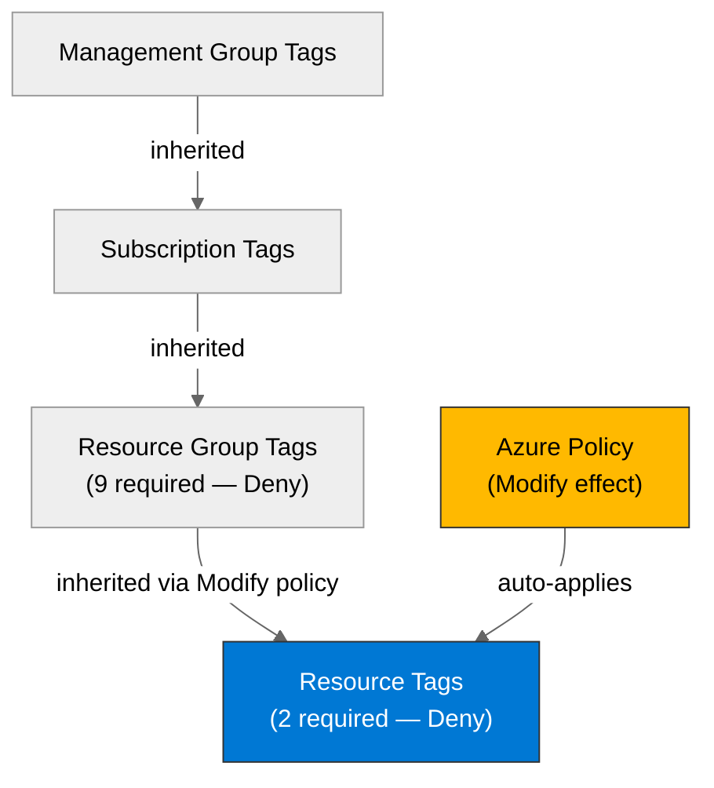

# 🛡️ Governance Constraints - terraform-e2e


<details open>
<summary><strong>📑 Governance Contents</strong></summary>

- [🔍 Discovery Source](#-discovery-source)
- [📋 Azure Policy Compliance](#-azure-policy-compliance)
- [🔄 Plan Adaptations Based on Policies](#-plan-adaptations-based-on-policies)
- [🚫 Deployment Blockers](#-deployment-blockers)
- [🏷️ Required Tags](#-required-tags)
- [🔐 Security Policies](#-security-policies)
- [💰 Cost Policies](#-cost-policies)
- [🌐 Network Policies](#-network-policies)
- [References](#references)

</details>

> Generated by terraform-plan agent | 2026-02-26

| ⬅️ Previous                                        | 📑 Index            | Next ➡️                                                |
| -------------------------------------------------- | ------------------- | ------------------------------------------------------ |
| [03-des-cost-estimate.md](03-des-cost-estimate.md) | [README](README.md) | [04-implementation-plan.md](04-implementation-plan.md) |

This document captures the governance constraints and Azure Policy requirements
that must be addressed in the Terraform implementation.

## 🔍 Discovery Source

> [!IMPORTANT]
> Governance constraints discovered from Azure REST API (includes management group-inherited policies).

| Query              | Results                         | Timestamp            |
| ------------------ | ------------------------------- | -------------------- |
| Policy Assignments | 28 policies discovered          | 2026-02-26T00:00:00Z |
| Tag Policies       | 11 tags required (2 res + 9 RG) | 2026-02-26T00:00:00Z |
| Security Policies  | 8 Deny constraints              | 2026-02-26T00:00:00Z |

**Discovery Method**: Azure REST API (`policyAssignments?api-version=2022-06-01`)
**Subscription**: noalz (`00858ffc-dded-4f0f-8bbf-e17fff0d47d9`)
**Scope**: Subscription + Management Group `2d04cb4c-999b-4e60-a3a7-e8993edc768b`

### Policy Definition Analysis

> [!IMPORTANT]
> **MANDATORY**: For all Deny and DeployIfNotExists policies, analysis of policy definition JSON (policyRule) performed below.

| Policy Display Name               | Assignment Scope | Effect | Actually Blocks                                                         | Evidence from policyRule.if                                                                                   | azurePropertyPath                                                | Required Value                          |
| --------------------------------- | ---------------- | ------ | ----------------------------------------------------------------------- | ------------------------------------------------------------------------------------------------------------- | ---------------------------------------------------------------- | --------------------------------------- |
| Allowed locations                 | Subscription     | Deny   | Resources outside swedencentral, germanywestcentral, global             | `field: "location", notIn: [swedencentral, germanywestcentral, global]`                                       | `location`                                                       | `swedencentral` or `germanywestcentral` |
| Storage no public blob access     | Subscription     | Deny   | Storage accounts with public blob access                                | `field: "type" equals "Microsoft.Storage/storageAccounts"` + `field: "allowBlobPublicAccess" notEquals false` | `storageAccounts.properties.allowBlobPublicAccess`               | `false`                                 |
| App Service HTTPS only            | Subscription     | Deny   | App Service apps without HTTPS                                          | `field: "type" equals "Microsoft.Web/sites"` + `field: "httpsOnly" equals false`                              | `sites.properties.httpsOnly`                                     | `true`                                  |
| Storage minimum TLS 1.2           | Subscription     | Deny   | Storage without TLS 1.2                                                 | `field: "minimumTlsVersion" notEquals "TLS1_2"`                                                               | `storageAccounts.properties.minimumTlsVersion`                   | `TLS1_2`                                |
| Storage HTTPS only                | Subscription     | Deny   | Storage without HTTPS traffic                                           | `field: "supportsHttpsTrafficOnly" equals false`                                                              | `storageAccounts.properties.supportsHttpsTrafficOnly`            | `true`                                  |
| Require Environment tag           | Subscription     | Deny   | Resources without `Environment` tag                                     | `field: "tags['Environment']" exists false`                                                                   | `tags.Environment`                                               | Must exist                              |
| Require Project tag               | Subscription     | Deny   | Resources without `Project` tag                                         | `field: "tags['Project']" exists false`                                                                       | `tags.Project`                                                   | Must exist                              |
| SQL Azure AD-only auth            | Subscription     | Deny   | SQL Servers without AAD-only auth                                       | `field: "type" equals "Microsoft.Sql/servers"` + `field: "azureADOnlyAuthentication" notEquals true`          | `sqlServers.properties.administrators.azureADOnlyAuthentication` | `true`                                  |
| JV-Enforce Resource Group Tags v3 | Management Group | Deny   | RGs missing any of 9 required tags                                      | `field: "type" equals "Microsoft.Resources/subscriptions/resourceGroups"` + `anyOf: 9 tag checks`             | `resourceGroups.tags.*`                                          | 9 tags required                         |
| Block Azure RM Resource Creation  | Management Group | Deny   | Classic resources only (ClassicCompute, ClassicStorage, ClassicNetwork) | `anyOf` with 7 conditions checking `field: "type"` for Microsoft.Classic\* types                              | N/A (Classic only)                                               | N/A                                     |

**Analysis Notes**:

- "Block Azure RM Resource Creation" only blocks Classic resources — does NOT block ARM/modern resources. Cleared as non-blocker.
- All Microhack policies use parameterized effects; all confirmed as `Deny` via assignment parameters.
- "JV-Enforce Resource Group Tags v3" requires 9 tags at the RG level (lowercase keys): `environment`, `owner`, `costcenter`, `application`, `workload`, `sla`, `backup-policy`, `maint-window`, `technical-contact`.
- "Allowed locations" policy excludes `global` from the deny condition and excludes `Microsoft.AzureActiveDirectory/b2cDirectories`.

## 📋 Azure Policy Compliance

| Category           | Constraint                                                | Implementation                                                      | Status                       |
| ------------------ | --------------------------------------------------------- | ------------------------------------------------------------------- | ---------------------------- |
| Location           | Resources in swedencentral/germanywestcentral/global only | All resources deployed to `swedencentral`; SWA uses `swedencentral` | ⚠️ Verify SWA region support |
| Tagging (Resource) | `Environment` tag required on all resources               | `Environment = "dev"` on all resources                              | ✅ Compliant                 |
| Tagging (Resource) | `Project` tag required on all resources                   | `Project = "terraform-e2e"` on all resources                        | ✅ Compliant                 |
| Tagging (RG)       | 9 tags required on resource groups                        | All 9 tags will be set on RG                                        | ✅ Compliant                 |
| Storage Security   | No public blob access                                     | `allow_nested_items_to_be_public = false`                           | ✅ Compliant                 |
| Storage Security   | HTTPS transfer only                                       | `https_traffic_only_enabled = true`                                 | ✅ Compliant                 |
| Storage Security   | TLS 1.2 minimum                                           | `min_tls_version = "TLS1_2"`                                        | ✅ Compliant                 |
| App Service        | HTTPS only                                                | `https_only = true`                                                 | ✅ Compliant                 |
| SQL Security       | Azure AD-only auth                                        | `azuread_authentication_only = true`                                | ✅ Compliant                 |
| Data Residency     | EU data residency (GDPR)                                  | All resources in swedencentral (EU)                                 | ✅ Compliant                 |
| Classic Resources  | "Block Azure RM" policy (MG-level)                        | No classic/RDFE resources planned                                   | ✅ Not Applicable            |
| SWA in westeurope  | Blocked by allowed-locations Deny policy                  | ❌ Cannot deploy SWA to westeurope — using swedencentral            | ❌ Blocked (adapted)         |

> [!WARNING]
> Static Web App region support for `swedencentral` requires verification. If not supported,
> a policy exemption for `westeurope` is needed (see Deployment Blockers section).

## 🔄 Plan Adaptations Based on Policies

> [!NOTE]
> This section documents how the implementation plan was adapted to comply with discovered Azure Policies.

### Architectural Changes

| Original Design     | Blocking Policy              | Effect | Adaptation Applied                                                                                                                                                 |
| ------------------- | ---------------------------- | ------ | ------------------------------------------------------------------------------------------------------------------------------------------------------------------ |
| SWA in `westeurope` | Allowed locations (Deny)     | Deny   | Changed to `swedencentral` — verify SWA region support; fallback: request policy exemption                                                                         |
| Standard 4 tags     | JV-Enforce RG Tags v3 (Deny) | Deny   | Expanded to 9 tags on resource group: `environment`, `owner`, `costcenter`, `application`, `workload`, `sla`, `backup-policy`, `maint-window`, `technical-contact` |

### Auto-Applied Resources

| Policy                              | Effect                   | Auto-Applied Resource                                      |
| ----------------------------------- | ------------------------ | ---------------------------------------------------------- |
| JV - Inherit Multiple Tags from RG  | Modify                   | Tags auto-inherited from resource group to child resources |
| MCAPSGov Deploy and Modify Policies | DeployIfNotExists/Modify | May auto-deploy security/monitoring extensions             |
| ASC DataProtection                  | DeployIfNotExists        | May auto-deploy data protection configurations             |

### Auto-Modified Configurations

| Policy                             | Effect | Auto-Applied Change                                                       |
| ---------------------------------- | ------ | ------------------------------------------------------------------------- |
| JV - Inherit Multiple Tags from RG | Modify | Up to 9 tag values auto-inherited from resource group to resources        |
| MFA for Resource Write Actions     | Deny   | MFA required for resource creation (user authentication, not IaC concern) |
| MFA for Resource Delete Actions    | Deny   | MFA required for resource deletion (user authentication, not IaC concern) |

## 🚫 Deployment Blockers

> [!CAUTION]
> **CRITICAL**: Potential blocker identified for Static Web App regional deployment.

### Allowed Locations — Static Web App Region Constraint

- **Policy ID**: `e56962a6-4747-49cd-b67b-bf8b01975c4c`
- **Assignment**: `microhack-allowed-locations`
- **Effect**: Deny
- **Scope**: Subscription
- **Enforcement Mode**: Default
- **Impact**: Static Web App was originally planned for `westeurope` (per azure-defaults skill recommendation). Policy restricts to `swedencentral`, `germanywestcentral`, and `global` only.
- **Assessment Date**: 2026-02-26

**Resolution Options**:

1. **Deploy SWA to `swedencentral`** (recommended):
   - Azure Static Web Apps has expanded region support significantly. Attempt deployment with `location = "swedencentral"`.
   - **Trade-offs**: None if region is supported; content remains globally distributed via CDN regardless of staging location.
   - **Risk Level**: Low — SWA region availability has expanded substantially since initial documentation.

2. **Request Policy Exemption for `westeurope`**:
   - **Justification**: SWA may have limited region support; `westeurope` is nearest EU region.
   - **Duration**: Permanent (SWA-specific exception)
   - **Risk Level**: Low
   - **Approval Process**: Azure Policy exemption request to tenant admin

**Status**: ⚠️ **Proceed with `swedencentral` — verify during `terraform plan`**

**Next Steps**:

- [x] Plan with `location = "swedencentral"` for SWA
- [ ] Verify during `terraform plan/apply` — if region not supported, escalate to policy exemption

### JV-Enforce Resource Group Tags v3 — Extended Tag Set

- **Policy ID**: `27833bcf-5909-4a37-891c-16a3cb06856d`
- **Assignment**: `b1ad1a690a5148ec8707ff17`
- **Effect**: Deny
- **Scope**: Management Group
- **Enforcement Mode**: Default
- **Impact**: Resource groups require 9 tags (not the standard 4). Missing any tag blocks RG creation.
- **Assessment Date**: 2026-02-26

**Resolution**: ✅ Plan adapted — all 9 tags included in resource group definition.

**Required RG Tags** (lowercase keys):

| Tag Key             | Planned Value          |
| ------------------- | ---------------------- |
| `environment`       | `dev`                  |
| `owner`             | `team-terraform`       |
| `costcenter`        | `terraform-e2e`        |
| `application`       | `terraform-e2e`        |
| `workload`          | `ecommerce-storefront` |
| `sla`               | `99.5`                 |
| `backup-policy`     | `default`              |
| `maint-window`      | `weekends`             |
| `technical-contact` | `team-terraform`       |

**Status**: ✅ **Resolved — 9 tags included in plan**

## 🏷️ Required Tags

### Resource-Level Tags (Deny Policies)

All resources must include these tags:

```hcl
locals {
  tags = {
    Environment = var.environment  # "dev"
    Project     = var.project      # "terraform-e2e"
    ManagedBy   = "Terraform"
    Owner       = var.owner        # "team-terraform"
  }
}
```

### Resource Group Tags (Deny Policy — 9 Required)

```hcl
resource "azurerm_resource_group" "this" {
  name     = "rg-terraform-e2e-dev"
  location = var.location

  tags = {
    environment       = var.environment       # "dev"
    owner             = var.owner             # "team-terraform"
    costcenter        = var.project           # "terraform-e2e"
    application       = var.project           # "terraform-e2e"
    workload          = "ecommerce-storefront"
    sla               = "99.5"
    "backup-policy"   = "default"
    "maint-window"    = "weekends"
    "technical-contact" = var.owner           # "team-terraform"
  }
}
```

> [!IMPORTANT]
> The RG policy uses **lowercase** tag keys (`environment` not `Environment`).
> The resource-level policies use **PascalCase** tag keys (`Environment`, `Project`).
> Both sets must be present — the Inherit Tags Modify policy copies RG tags to resources.



## 🔐 Security Policies

| Policy                   | Requirement           | Terraform Property                                        | Status     |
| ------------------------ | --------------------- | --------------------------------------------------------- | ---------- |
| HTTPS Only (App Service) | `httpsOnly = true`    | `https_only = true` on `azurerm_linux_web_app`            | ✅ Planned |
| TLS Version (Storage)    | TLS 1.2 minimum       | `min_tls_version = "TLS1_2"` on `azurerm_storage_account` | ✅ Planned |
| Public Access (Storage)  | No public blob access | `allow_nested_items_to_be_public = false`                 | ✅ Planned |
| HTTPS Transfer (Storage) | HTTPS-only traffic    | `https_traffic_only_enabled = true`                       | ✅ Planned |
| Managed Identity         | Preferred over keys   | System-assigned identity on App Service                   | ✅ Planned |
| Key Vault RBAC           | RBAC authorization    | `enable_rbac_authorization = true`                        | ✅ Planned |
| SQL AD-Only Auth         | Azure AD-only         | `azuread_authentication_only = true` on SQL Server        | ✅ Planned |
| Azure Security Baseline  | Comprehensive (MG)    | Audit-only — no deployment blocking                       | ℹ️ Audit   |

## 💰 Cost Policies

| Policy            | Constraint                             | Impact                            |
| ----------------- | -------------------------------------- | --------------------------------- |
| Budget            | No budget policies discovered          | No cost restrictions              |
| SKU Restrictions  | No SKU restriction policies discovered | Free/Basic/B1 SKUs permitted      |
| Reserved Capacity | No reservation policies                | Consumption-based model permitted |

## 🌐 Network Policies

| Policy            | Constraint                                          | Impact                                   |
| ----------------- | --------------------------------------------------- | ---------------------------------------- |
| Private Endpoints | No private endpoint enforcement                     | Public endpoints permitted for dev       |
| VNet Integration  | No VNet integration enforcement                     | No VNet required for dev                 |
| Public Endpoints  | No public access restrictions (except storage blob) | Public endpoints acceptable              |
| Allowed locations | swedencentral, germanywestcentral, global only      | All resources must be in allowed regions |

---

## References

| Topic                | Link                                                                                                                       |
| -------------------- | -------------------------------------------------------------------------------------------------------------------------- |
| Azure Policy         | [Overview](https://learn.microsoft.com/azure/governance/policy/overview)                                                   |
| Azure Resource Graph | [ARG Overview](https://learn.microsoft.com/azure/governance/resource-graph/overview)                                       |
| Tag Governance       | [Tagging Strategy](https://learn.microsoft.com/azure/cloud-adoption-framework/ready/azure-best-practices/resource-tagging) |
| Policy Effects       | [Understanding Effects](https://learn.microsoft.com/azure/governance/policy/concepts/effects)                              |

---

_Governance constraints discovered from Azure REST API (management group + subscription scope)._
_See [governance-discovery.instructions.md](/.github/instructions/governance-discovery.instructions.md) for discovery methodology._

---

<div align="center">

| ⬅️ [03-des-cost-estimate.md](03-des-cost-estimate.md) | 🏠 [Project Index](README.md) | ➡️ [04-implementation-plan.md](04-implementation-plan.md) |
| ----------------------------------------------------- | ----------------------------- | --------------------------------------------------------- |

</div>
