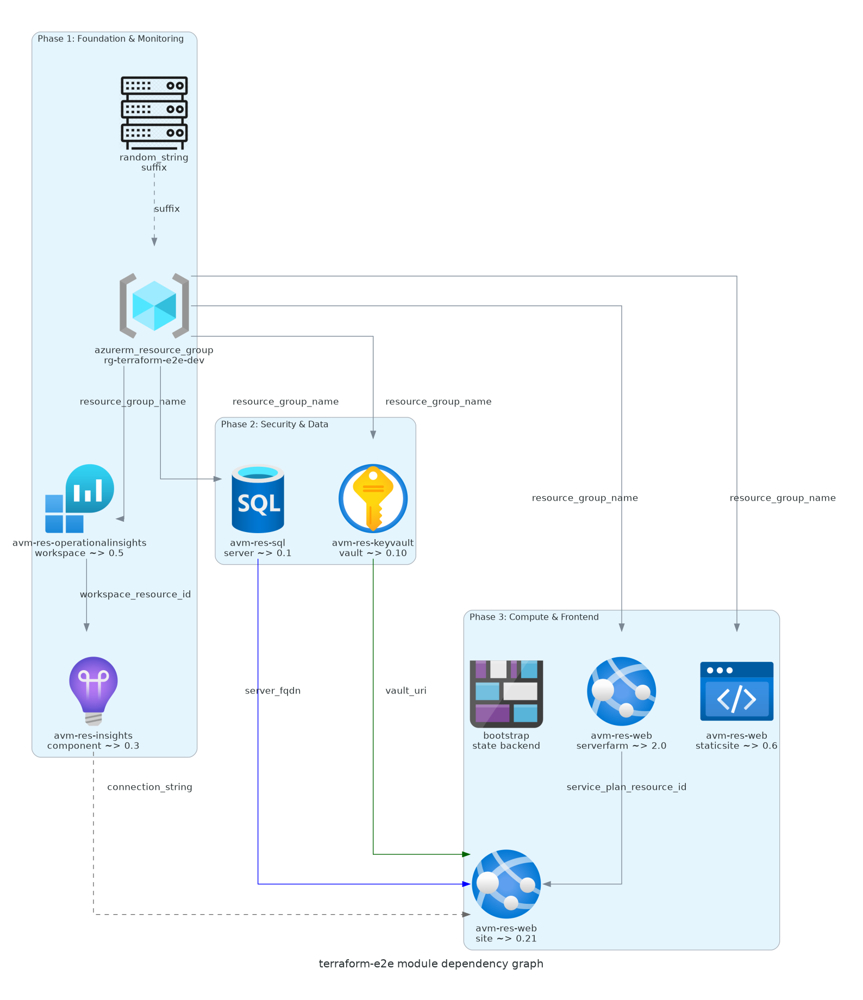
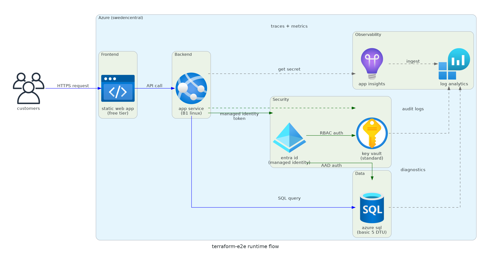

# 📀 Step 4: Implementation Plan - terraform-e2e


<details open>
<summary><strong>📑 Implementation Contents</strong></summary>

- [📋 Overview](#-overview)
- [📦 Resource Inventory](#-resource-inventory)
- [🗂️ Module Structure](#-module-structure)
- [🔨 Implementation Tasks](#-implementation-tasks)
- [🚀 Deployment Phases](#-deployment-phases)
- [🔗 Dependency Graph](#-dependency-graph)
- [🔄 Runtime Flow Diagram](#-runtime-flow-diagram)
- [🏷️ Naming Conventions](#-naming-conventions)
- [🔐 Security Configuration](#-security-configuration)
- [⏱️ Estimated Implementation Time](#-estimated-implementation-time)
- [🔒 Approval Gate](#-approval-gate)
- [References](#references)

</details>

> Generated by terraform-plan agent | 2026-02-26

| ⬅️ Previous                                                  | 📑 Index            | Next ➡️                                                          |
| ------------------------------------------------------------ | ------------------- | ---------------------------------------------------------------- |
| [04-governance-constraints.md](04-governance-constraints.md) | [README](README.md) | [05-implementation-reference.md](05-implementation-reference.md) |

## 📋 Overview

Terraform implementation plan for the **terraform-e2e** project — a small ecommerce
storefront on Azure using a Cost-Optimized N-Tier architecture pattern: App Service
(frontend) → App Service B1 (backend API) → Azure SQL Basic (data store), with Key Vault
for secrets, Application Insights + Log Analytics for monitoring, and an Azure Storage
Account for Terraform remote state.

> [!NOTE]
> SWA (Static Web App) was originally planned but is **not available in swedencentral**.
> Replaced with a second App Service sharing the B1 plan.

**Key Parameters**:

| Parameter              | Value                                                                         |
| ---------------------- | ----------------------------------------------------------------------------- |
| IaC Tool               | Terraform (azurerm ~> 4.0)                                                    |
| Provider Version       | `~> 4.0` (latest stable: 4.61.0)                                              |
| Terraform Version      | `>= 1.9`                                                                      |
| Region                 | swedencentral                                                                 |
| Environment            | dev                                                                           |
| AVM Coverage           | 6/6 services (SWA replaced with App Service — not available in swedencentral) |
| State Backend          | Azure Blob Storage (`azurerm` backend)                                        |
| Estimated Monthly Cost | ~$25–$60                                                                      |
| Deployment Strategy    | Phased (3 phases)                                                             |

> [!NOTE]
> SWA (Static Web App) is not available in swedencentral. The frontend is now served
> by a second App Service sharing the B1 Linux plan. AVM coverage remains complete (6/6).

---

## 📦 Resource Inventory

| #   | Resource                | Terraform AVM Module                                  | Version   | SKU/Tier        | Dependencies                              | Status  |
| --- | ----------------------- | ----------------------------------------------------- | --------- | --------------- | ----------------------------------------- | ------- |
| 1   | Resource Group          | `azurerm_resource_group` (native)                     | —         | —               | None                                      | ⬜ Todo |
| 2   | App Service (Frontend)  | `Azure/avm-res-web-site/azurerm`                      | `~> 0.21` | —               | app_service_plan                          | ⬜ Todo |
| 3   | App Service Plan        | `Azure/avm-res-web-serverfarm/azurerm`                | `~> 2.0`  | B1 (Linux)      | resource_group                            | ⬜ Todo |
| 4   | App Service (Linux)     | `Azure/avm-res-web-site/azurerm`                      | `~> 0.21` | —               | app_service_plan, key_vault, app_insights | ⬜ Todo |
| 5   | SQL Server              | `Azure/avm-res-sql-server/azurerm`                    | `~> 0.1`  | —               | resource_group                            | ⬜ Todo |
| 6   | SQL Database            | (included in SQL Server module)                       | —         | Basic (5 DTU)   | sql_server                                | ⬜ Todo |
| 7   | Key Vault               | `Azure/avm-res-keyvault-vault/azurerm`                | `~> 0.10` | Standard        | resource_group                            | ⬜ Todo |
| 8   | Log Analytics           | `Azure/avm-res-operationalinsights-workspace/azurerm` | `~> 0.5`  | Per GB          | resource_group                            | ⬜ Todo |
| 9   | Application Insights    | `Azure/avm-res-insights-component/azurerm`            | `~> 0.3`  | Workspace-based | log_analytics                             | ⬜ Todo |
| 10  | Storage Account (state) | `azurerm_storage_account` (bootstrap)                 | —         | Standard LRS    | (pre-existing)                            | ⬜ Todo |

> [!TIP]
> SQL Database is provisioned as part of the SQL Server AVM module via the `databases` parameter,
> not as a separate module call.

### AVM Module Verification Summary

| Module           | Registry Source                                                                     | Latest Version | Verified                 |
| ---------------- | ----------------------------------------------------------------------------------- | -------------- | ------------------------ |
| App Service Plan | `registry.terraform.io/modules/Azure/avm-res-web-serverfarm/azurerm`                | 2.0.2          | ✅                       |
| App Service      | `registry.terraform.io/modules/Azure/avm-res-web-site/azurerm`                      | 0.21.0         | ✅                       |
| SQL Server       | `registry.terraform.io/modules/Azure/avm-res-sql-server/azurerm`                    | 0.1.6          | ✅                       |
| Key Vault        | `registry.terraform.io/modules/Azure/avm-res-keyvault-vault/azurerm`                | 0.10.2         | ✅                       |
| Log Analytics    | `registry.terraform.io/modules/Azure/avm-res-operationalinsights-workspace/azurerm` | 0.5.1          | ✅                       |
| App Insights     | `registry.terraform.io/modules/Azure/avm-res-insights-component/azurerm`            | 0.3.0          | ✅                       |
| App Service (FE) | `registry.terraform.io/modules/Azure/avm-res-web-site/azurerm`                      | 0.21.0         | ✅ (shared with backend) |

---

## 🗂️ Module Structure

```text
infra/terraform/terraform-e2e/
├── main.tf                  # Root module — orchestrates all AVM modules
├── variables.tf             # Input variables (project, environment, location, owner)
├── outputs.tf               # Module outputs (resource IDs, endpoints, connection strings)
├── locals.tf                # Local values (naming, tags, unique suffix)
├── providers.tf             # Provider configuration (azurerm ~> 4.0, random)
├── backend.tf               # Azure Storage backend configuration
├── terraform.tfvars         # Default variable values for dev environment
└── bootstrap/
    └── bootstrap.sh         # Pre-init script to create state storage account
```

| Module / Resource  | AVM Source                                            | Version   | Purpose                            |
| ------------------ | ----------------------------------------------------- | --------- | ---------------------------------- |
| `resource_group`   | `azurerm_resource_group` (native)                     | —         | Foundation resource group          |
| `log_analytics`    | `Azure/avm-res-operationalinsights-workspace/azurerm` | `~> 0.5`  | Central log aggregation            |
| `app_insights`     | `Azure/avm-res-insights-component/azurerm`            | `~> 0.3`  | Application performance monitoring |
| `key_vault`        | `Azure/avm-res-keyvault-vault/azurerm`                | `~> 0.10` | Centralized secret management      |
| `sql_server`       | `Azure/avm-res-sql-server/azurerm`                    | `~> 0.1`  | SQL Server + Database              |
| `app_service_plan` | `Azure/avm-res-web-serverfarm/azurerm`                | `~> 2.0`  | B1 Linux compute plan              |
| `app_service`      | `Azure/avm-res-web-site/azurerm`                      | `~> 0.21` | Backend REST API                   |
| `app_service_fe`   | `Azure/avm-res-web-site/azurerm`                      | `~> 0.21` | Frontend storefront                |
| `random_string`    | `hashicorp/random`                                    | `~> 3.0`  | 4-char unique suffix               |

> [!NOTE]
> All modules are called from `main.tf` in a flat structure (no `modules/` subdirectory).
> AVM modules encapsulate resource complexity — custom wrapper modules are unnecessary.

---

## 🔨 Implementation Tasks

### Task 1: providers.tf (Provider Configuration)

**Purpose**: Configure Terraform providers and version constraints.

```yaml
- resource: "Provider Configuration"
  providers:
    - name: "azurerm"
      source: "hashicorp/azurerm"
      version: "~> 4.0"
      features: {}
    - name: "random"
      source: "hashicorp/random"
      version: "~> 3.0"
  required_terraform_version: ">= 1.9"
```

### Task 2: backend.tf (State Backend)

**Purpose**: Configure Azure Blob Storage remote state with native locking.

```yaml
- resource: "State Backend"
  backend: "azurerm"
  config:
    resource_group_name: "rg-tfstate-dev"
    storage_account_name: "sttfstatedev{suffix}"
    container_name: "tfstate"
    key: "terraform-e2e.terraform.tfstate"
  note: "Azure Blob Storage provides native state locking via blob leases"
```

### Task 3: variables.tf + locals.tf (Variables & Naming)

**Purpose**: Define input variables and derive naming conventions.

**Variables**:

| Variable           | Type     | Default            | Description                      |
| ------------------ | -------- | ------------------ | -------------------------------- |
| `project`          | `string` | `"terraform-e2e"`  | Project identifier               |
| `environment`      | `string` | `"dev"`            | Deployment environment           |
| `location`         | `string` | `"swedencentral"`  | Primary Azure region             |
| `owner`            | `string` | `"team-terraform"` | Resource owner                   |
| `deployment_phase` | `number` | `3`                | Controls phased deployment (1-3) |

**Locals** (naming + tags):

```yaml
- local: "suffix"
  source: "random_string.suffix.result" # 4-char unique suffix
- local: "tags"
  value:
    Environment: var.environment
    Project: var.project
    ManagedBy: "Terraform"
    Owner: var.owner
- local: "rg_tags"
  value:
    environment: var.environment
    owner: var.owner
    costcenter: var.project
    application: var.project
    workload: "ecommerce-storefront"
    sla: "99.5"
    backup-policy: "default"
    maint-window: "weekends"
    technical-contact: var.owner
```

### Task 4: Resource Group

```yaml
- resource: "Resource Group"
  type: "azurerm_resource_group"
  name: "rg-terraform-e2e-dev"
  location: "swedencentral"
  tags: "local.rg_tags"
  phase: 1
  dependencies: []
```

### Task 5: Log Analytics Workspace

```yaml
- resource: "Log Analytics Workspace"
  module: "Azure/avm-res-operationalinsights-workspace/azurerm"
  version: "~> 0.5"
  name: "log-terraform-e2e-dev-{suffix}"
  config:
    sku_name: "PerGB2018"
    retention_in_days: 30
  azurePropertyPath: "operationalInsights.workspace.properties.retentionInDays"
  tags: "local.tags"
  naming: "log-{project}-{env}-{suffix}"
  phase: 1
  dependencies: ["resource_group"]
```

### Task 6: Application Insights

```yaml
- resource: "Application Insights"
  module: "Azure/avm-res-insights-component/azurerm"
  version: "~> 0.3"
  name: "appi-terraform-e2e-dev-{suffix}"
  config:
    application_type: "web"
    workspace_resource_id: "module.log_analytics.resource_id"
    daily_data_cap_in_gb: 0.5
  azurePropertyPath: "insights.component.properties.WorkspaceResourceId"
  tags: "local.tags"
  naming: "appi-{project}-{env}-{suffix}"
  phase: 1
  dependencies: ["log_analytics"]
```

### Task 7: Key Vault

```yaml
- resource: "Key Vault"
  module: "Azure/avm-res-keyvault-vault/azurerm"
  version: "~> 0.10"
  name: "kv-tfe2e-dev-{suffix}"
  config:
    sku_name: "standard"
    enable_rbac_authorization: true
    purge_protection_enabled: true
    soft_delete_retention_days: 90
    tenant_id: "data.azurerm_client_config.current.tenant_id"
  azurePropertyPath: "keyVault.properties.enableRbacAuthorization"
  tags: "local.tags"
  naming: "kv-{short}-{env}-{suffix}"
  phase: 2
  dependencies: ["resource_group"]
```

### Task 8: SQL Server + Database

```yaml
- resource: "SQL Server"
  module: "Azure/avm-res-sql-server/azurerm"
  version: "~> 0.1"
  name: "sql-terraform-e2e-dev-{suffix}"
  config:
    azuread_authentication_only: true
    minimum_tls_version: "1.2"
    databases:
      ecommerce:
        name: "sqldb-terraform-e2e-dev"
        sku_name: "Basic"
        max_size_gb: 2
  azurePropertyPath: "sqlServers.properties.administrators.azureADOnlyAuthentication"
  tags: "local.tags"
  naming: "sql-{project}-{env}-{suffix}"
  phase: 2
  dependencies: ["resource_group", "key_vault"]
```

### Task 9: App Service Plan

```yaml
- resource: "App Service Plan"
  module: "Azure/avm-res-web-serverfarm/azurerm"
  version: "~> 2.0"
  name: "asp-terraform-e2e-dev"
  config:
    os_type: "Linux"
    sku_name: "B1"
  azurePropertyPath: "serverFarms.properties.reserved"
  tags: "local.tags"
  naming: "asp-{project}-{env}"
  phase: 3
  dependencies: ["resource_group"]
```

### Task 10: App Service (Linux Web App)

```yaml
- resource: "App Service"
  module: "Azure/avm-res-web-site/azurerm"
  version: "~> 0.21"
  name: "app-terraform-e2e-dev-{suffix}"
  config:
    kind: "linux"
    https_only: true
    minimum_tls_version: "1.2"
    service_plan_resource_id: "module.app_service_plan.resource_id"
    system_assigned_identity: true
    app_settings:
      APPLICATIONINSIGHTS_CONNECTION_STRING: "module.app_insights.connection_string"
      KEY_VAULT_URI: "module.key_vault.uri"
  azurePropertyPath: "sites.properties.httpsOnly"
  tags: "local.tags"
  naming: "app-{project}-{env}-{suffix}"
  phase: 3
  dependencies: ["app_service_plan", "key_vault", "app_insights", "sql_server"]
```

### Task 11: App Service (Frontend)

```yaml
- resource: "App Service (Frontend)"
  module: "Azure/avm-res-web-site/azurerm"
  version: "~> 0.21"
  name: "app-terraform-e2e-fe-dev-{suffix}"
  config:
    kind: "linux"
    https_only: true
    minimum_tls_version: "1.2"
    service_plan_resource_id: "module.app_service_plan.resource_id"
    system_assigned_identity: true
    app_settings:
      APPLICATIONINSIGHTS_CONNECTION_STRING: "module.app_insights.connection_string"
  azurePropertyPath: "sites.properties.httpsOnly"
  tags: "local.tags"
  naming: "app-{project}-fe-{env}-{suffix}"
  phase: 3
  dependencies: ["app_service_plan", "app_insights"]
  note: "Replaces SWA — Static Web App not available in swedencentral. Shares B1 plan with backend."
```

### Task 12: Role Assignments

```yaml
- resource: "RBAC Role Assignments"
  type: "azurerm_role_assignment"
  assignments:
    - scope: "module.key_vault.resource_id"
      role: "Key Vault Secrets User"
      principal: "module.app_service.identity.principal_id"
    - scope: "module.sql_server.resource_id"
      role: "Contributor"
      principal: "module.app_service.identity.principal_id"
  phase: 3
  dependencies: ["app_service", "key_vault", "sql_server"]
```

### Task 13: bootstrap/bootstrap.sh (State Backend Bootstrap)

**Purpose**: Create the Azure Storage Account for Terraform state before `terraform init`.

**Features**:

- Creates resource group for state storage
- Creates storage account with security policies (no public blob, HTTPS, TLS 1.2)
- Creates blob container for state files
- Applies required tags (9 RG tags + 4 resource tags)

---

## 🚀 Deployment Phases

> Deployment strategy: **Phased** (3 phases with `var.deployment_phase` conditional)

### Phase 1: Foundation & Monitoring

| Order | Module                        | Resources               | Validation                                       |
| ----- | ----------------------------- | ----------------------- | ------------------------------------------------ |
| 1.1   | `random_string.suffix`        | Unique suffix (4 chars) | `terraform plan` — verify suffix generated       |
| 1.2   | `azurerm_resource_group.this` | Resource Group          | Verify 9 RG tags present                         |
| 1.3   | `module.log_analytics`        | Log Analytics Workspace | Verify workspace created, 30-day retention       |
| 1.4   | `module.app_insights`         | Application Insights    | Verify linked to Log Analytics, 0.5 GB daily cap |

**Conditional**: `var.deployment_phase >= 1`

**Approval Gate**: ✅ Verify foundation resources exist and monitoring pipeline operational before proceeding.

### Phase 2: Security & Data

| Order | Module              | Resources                  | Validation                                        |
| ----- | ------------------- | -------------------------- | ------------------------------------------------- |
| 2.1   | `module.key_vault`  | Key Vault (Standard, RBAC) | Verify RBAC auth, purge protection, soft delete   |
| 2.2   | `module.sql_server` | SQL Server + Basic DB      | Verify AD-only auth, TLS 1.2, database accessible |

**Conditional**: `var.deployment_phase >= 2`

**Approval Gate**: ✅ Verify security controls (Key Vault RBAC, SQL AD-only auth) before deploying compute tier.

### Phase 3: Compute & Frontend

| Order | Module                      | Resources                | Validation                                                       |
| ----- | --------------------------- | ------------------------ | ---------------------------------------------------------------- |
| 3.1   | `module.app_service_plan`   | B1 Linux Plan            | Verify SKU and OS type                                           |
| 3.2   | `module.app_service`        | Linux Web App + Identity | Verify HTTPS-only, managed identity, app settings                |
| 3.3   | `module.app_service_fe`     | App Service (Frontend)   | Verify HTTPS-only, managed identity, default hostname accessible |
| 3.4   | `azurerm_role_assignment.*` | RBAC bindings            | Verify App Service can read Key Vault secrets                    |

**Conditional**: `var.deployment_phase >= 3`

**Approval Gate**: ✅ Verify end-to-end connectivity: Frontend App Service → Backend App Service → SQL, telemetry flowing to App Insights.

### Phase Summary

| Phase                       | Resources | Est. Deploy Time | Approval Gate |
| --------------------------- | --------- | ---------------- | ------------- |
| 1 — Foundation & Monitoring | 4         | ~3 min           | ✅            |
| 2 — Security & Data         | 3         | ~5 min           | ✅            |
| 3 — Compute & Frontend      | 5         | ~5 min           | ✅            |
| **Total**                   | **12**    | **~13 min**      | —             |

### Phased Deployment Commands

```bash
# Phase 1: Foundation & Monitoring
terraform apply -var="deployment_phase=1" -auto-approve

# Phase 2: Security & Data (after Phase 1 validation)
terraform apply -var="deployment_phase=2" -auto-approve

# Phase 3: Compute & Frontend (after Phase 2 validation)
terraform apply -var="deployment_phase=3" -auto-approve
```

---

## 🔗 Dependency Graph



Source: [04-dependency-diagram.py](./04-dependency-diagram.py)

> Nodes map to Implementation Tasks above. Edges represent `depends_on` or output-to-input wiring.

---

## 🔄 Runtime Flow Diagram



Source: [04-runtime-diagram.py](./04-runtime-diagram.py)

> Shows request/auth/secret/telemetry paths at runtime — not deployment dependencies.

---

## 🏷️ Naming Conventions

| Resource         | Pattern                           | Example                         | Generated Name                      |
| ---------------- | --------------------------------- | ------------------------------- | ----------------------------------- |
| Resource Group   | `rg-{project}-{env}`              | `rg-terraform-e2e-dev`          | `rg-terraform-e2e-dev`              |
| Log Analytics    | `log-{project}-{env}-{suffix}`    | `log-terraform-e2e-dev-a1b2`    | `log-terraform-e2e-dev-{suffix}`    |
| App Insights     | `appi-{project}-{env}-{suffix}`   | `appi-terraform-e2e-dev-a1b2`   | `appi-terraform-e2e-dev-{suffix}`   |
| Key Vault        | `kv-{short}-{env}-{suffix}`       | `kv-tfe2e-dev-a1b2`             | `kv-tfe2e-dev-{suffix}` (≤24 chars) |
| SQL Server       | `sql-{project}-{env}-{suffix}`    | `sql-terraform-e2e-dev-a1b2`    | `sql-terraform-e2e-dev-{suffix}`    |
| SQL Database     | `sqldb-{project}-{env}`           | `sqldb-terraform-e2e-dev`       | `sqldb-terraform-e2e-dev`           |
| App Service Plan | `asp-{project}-{env}`             | `asp-terraform-e2e-dev`         | `asp-terraform-e2e-dev`             |
| App Service      | `app-{project}-{env}-{suffix}`    | `app-terraform-e2e-dev-a1b2`    | `app-terraform-e2e-dev-{suffix}`    |
| App Service (FE) | `app-{project}-fe-{env}-{suffix}` | `app-terraform-e2e-fe-dev-a1b2` | `app-terraform-e2e-fe-dev-{suffix}` |
| Storage (state)  | `st{short}{env}{suffix}`          | `sttfstatedev1234`              | `sttfstatedev{suffix}` (≤24 chars)  |

> [!IMPORTANT]
> Key Vault and Storage Account names have a **24-character limit** and must be globally unique.
> Use `take()` equivalent logic with `substr()` in Terraform to truncate names within limits.

---

## 🔐 Security Configuration

| Resource        | Security Setting                  | Value              | Policy Enforced   |
| --------------- | --------------------------------- | ------------------ | ----------------- |
| App Service     | `https_only`                      | `true`             | ✅ Deny policy    |
| App Service     | `minimum_tls_version`             | `"1.2"`            | Security baseline |
| App Service     | System-assigned managed identity  | Enabled            | Best practice     |
| SQL Server      | `azuread_authentication_only`     | `true`             | ✅ Deny policy    |
| SQL Server      | `minimum_tls_version`             | `"1.2"`            | Security baseline |
| Key Vault       | `enable_rbac_authorization`       | `true`             | Best practice     |
| Key Vault       | `purge_protection_enabled`        | `true`             | Best practice     |
| Key Vault       | `soft_delete_retention_days`      | `90`               | Best practice     |
| Storage (state) | `allow_nested_items_to_be_public` | `false`            | ✅ Deny policy    |
| Storage (state) | `https_traffic_only_enabled`      | `true`             | ✅ Deny policy    |
| Storage (state) | `min_tls_version`                 | `"TLS1_2"`         | ✅ Deny policy    |
| All resources   | `Environment` tag                 | `"dev"`            | ✅ Deny policy    |
| All resources   | `Project` tag                     | `"terraform-e2e"`  | ✅ Deny policy    |
| Resource Group  | 9 required tags                   | See governance doc | ✅ Deny policy    |

### Azure Storage Backend Configuration

```hcl
terraform {
  backend "azurerm" {
    resource_group_name  = "rg-tfstate-dev"
    storage_account_name = "sttfstatedev{suffix}"
    container_name       = "tfstate"
    key                  = "terraform-e2e.terraform.tfstate"
  }
}
```

> Azure Blob Storage provides native state locking via blob leases — no additional DynamoDB-style
> locking configuration required.

---

## ⏱️ Estimated Implementation Time

| Task                                                         | Estimated Duration |
| ------------------------------------------------------------ | ------------------ |
| `providers.tf` + `backend.tf` + `variables.tf` + `locals.tf` | 30 minutes         |
| Bootstrap script (`bootstrap.sh`)                            | 15 minutes         |
| Foundation modules (RG, Log Analytics, App Insights)         | 45 minutes         |
| Security modules (Key Vault, SQL Server)                     | 45 minutes         |
| Compute modules (App Service Plan, App Service, SWA)         | 60 minutes         |
| Role assignments + wiring                                    | 30 minutes         |
| `outputs.tf` + `terraform.tfvars`                            | 15 minutes         |
| Testing (`terraform validate` + `terraform plan`)            | 30 minutes         |
| **Total**                                                    | **~4.5 hours**     |

---

## 🔒 Approval Gate

> [!IMPORTANT]
> **📋 Implementation Plan Ready**
>
> | Metric                           | Value                                   |
> | -------------------------------- | --------------------------------------- |
> | Azure resources planned          | 12 (incl. RBAC assignments)             |
> | AVM-TF modules used              | 7                                       |
> | Raw azurerm resources            | 3 (RG, random_string, role_assignments) |
> | Governance constraints addressed | ✅ 10 Deny policies compliant           |
> | CAF naming conventions applied   | ✅ All resources follow CAF             |
> | Deployment strategy              | Phased (3 phases)                       |
> | State backend                    | Azure Blob Storage                      |
> | Estimated monthly cost           | ~$25–$60                                |
> | Estimated implementation time    | ~4.5 hours                              |
>
> **Challenger Review Summary** (1 governance + 3 plan passes):
>
> | Category                 | must_fix | should_fix | suggestions |
> | ------------------------ | -------- | ---------- | ----------- |
> | Governance               | 0        | 1          | 1           |
> | Security-Governance      | 0        | 2          | 1           |
> | Architecture-Reliability | 0        | 1          | 2           |
> | Cost-Feasibility         | 0        | 0          | 2           |
> | **Total**                | **0**    | **4**      | **6**       |
>
> Key findings:
>
> - ~~should_fix: Verify SWA region support in swedencentral~~ → **Resolved**: Replaced SWA with frontend App Service
> - ~~should_fix: Add `lifecycle { prevent_destroy = true }` on Key Vault and SQL Database~~ → **Dismissed**: Not required per user
> - should_fix: Configure diagnostic settings for all resources via Log Analytics
> - should_fix: Add App Service health check endpoint configuration
>
> Findings saved to:
>
> - `agent-output/terraform-e2e/challenge-findings-governance-constraints.json`
> - `agent-output/terraform-e2e/challenge-findings-implementation-plan-pass1.json`
> - `agent-output/terraform-e2e/challenge-findings-implementation-plan-pass2.json`
> - `agent-output/terraform-e2e/challenge-findings-implementation-plan-pass3.json`
> - [x] **Approved** — proceed to terraform-code
> - **Approver**: User
> - **Date**: 2026-02-26
>
> Reply **"approve"** to proceed to terraform-code, or provide feedback.

---

## References

> [!NOTE]
> 📚 The following Microsoft Learn resources inform this implementation.

| Topic                      | Link                                                                                                                          |
| -------------------------- | ----------------------------------------------------------------------------------------------------------------------------- |
| Azure Verified Modules     | [AVM Index](https://aka.ms/avm/index)                                                                                         |
| Terraform Best Practices   | [HashiCorp Docs](https://developer.hashicorp.com/terraform/language/modules/develop)                                          |
| CAF Naming Conventions     | [Naming Rules](https://learn.microsoft.com/azure/cloud-adoption-framework/ready/azure-best-practices/resource-naming)         |
| Resource Abbreviations     | [Abbreviations](https://learn.microsoft.com/azure/cloud-adoption-framework/ready/azure-best-practices/resource-abbreviations) |
| Azure Policy               | [Overview](https://learn.microsoft.com/azure/governance/policy/overview)                                                      |
| Terraform AzureRM Provider | [Registry](https://registry.terraform.io/providers/hashicorp/azurerm/latest)                                                  |
| Remote State on Azure      | [Backend Config](https://developer.hashicorp.com/terraform/language/settings/backends/azurerm)                                |

---

_Plan generated by terraform-plan agent following Azure Well-Architected Framework guidelines._

---

<div align="center">

| ⬅️ [04-governance-constraints.md](04-governance-constraints.md) | 🏠 [Project Index](README.md) | ➡️ [05-implementation-reference.md](05-implementation-reference.md) |
| --------------------------------------------------------------- | ----------------------------- | ------------------------------------------------------------------- |

</div>
