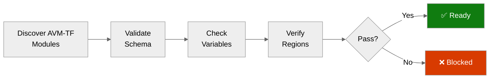

# ✅ Step 4b: Pre-Flight AVM-TF Check - terraform-e2e

<strong>📑 Pre-Flight Contents</strong>

- [🎯 Purpose](#-purpose)
- [✅ AVM Schema Validation Results](#-avm-schema-validation-results)
- [� Provider Version Resolution](#-provider-version-resolution)
- [🔎 Parameter Type Analysis](#-parameter-type-analysis)
- [📋 Variable Schema Cross-Validation](#-variable-schema-cross-validation)
- [🌍 Region Limitations Identified](#-region-limitations-identified)
- [⚠️ Pitfalls Checklist](#-pitfalls-checklist)
- [🚀 Ready for Implementation](#-ready-for-implementation)

> Generated by terraform-code agent | 2026-02-26
> Source: Terraform Registry MCP (`search_modules` → `get_module_details` → `get_latest_module_version`)
> Status: **PASS**

| ⬅️ Previous                                            | 📑 Index            | Next ➡️                                                          |
| ------------------------------------------------------ | ------------------- | ---------------------------------------------------------------- |
| [04-implementation-plan.md](04-implementation-plan.md) | [README](README.md) | [05-implementation-reference.md](05-implementation-reference.md) |

## 🎯 Purpose

> [!IMPORTANT]
> This checkpoint validates AVM-TF module schemas BEFORE Terraform code generation
> by querying the Terraform Registry for latest versions and variable schemas.

Prevents:

- Variable type mismatches (e.g., `parent_id` vs `resource_group_name`)
- Deprecated variable usage
- Region availability issues
- Missing required variables
- Version constraint drift

## ✅ AVM Schema Validation Results

| Resource              | AVM-TF Module                                         | Pinned    | Latest   | Match | Verified | Published  |
| --------------------- | ----------------------------------------------------- | --------- | -------- | ----- | -------- | ---------- |
| Log Analytics         | `Azure/avm-res-operationalinsights-workspace/azurerm` | `~> 0.5`  | `0.5.1`  | ✅    | ✅       | 2025-12-23 |
| Application Insights  | `Azure/avm-res-insights-component/azurerm`            | `~> 0.3`  | `0.3.0`  | ✅    | ✅       | 2026-02-19 |
| Key Vault             | `Azure/avm-res-keyvault-vault/azurerm`                | `~> 0.10` | `0.10.2` | ✅    | ✅       | 2025-10-14 |
| SQL Server + Database | `Azure/avm-res-sql-server/azurerm`                    | `~> 0.1`  | `0.1.6`  | ✅    | ✅       | 2025-10-06 |
| App Service Plan      | `Azure/avm-res-web-serverfarm/azurerm`                | `~> 2.0`  | `2.0.2`  | ✅    | ✅       | 2026-02-20 |
| App Service (BE+FE)   | `Azure/avm-res-web-site/azurerm`                      | `~> 0.21` | `0.21.0` | ✅    | ✅       | 2026-02-19 |

> **Version Match**: All `~>` pessimistic version constraints resolve to latest available versions within their bands.

### Download Counts (Module Adoption)

| Module                                | Downloads |
| ------------------------------------- | --------: |
| avm-res-keyvault-vault                | 1,879,954 |
| avm-res-operationalinsights-workspace |   577,656 |
| avm-res-web-site                      |   329,353 |
| avm-res-insights-component            |   222,142 |
| avm-res-web-serverfarm                |   209,042 |
| avm-res-sql-server                    |   174,107 |

## 🔗 Provider Version Resolution

| Provider            | Pinned   | Latest   | Match | Source   |
| ------------------- | -------- | -------- | ----- | -------- |
| `hashicorp/azurerm` | `~> 4.0` | `4.61.0` | ✅    | Registry |
| `hashicorp/random`  | `~> 3.0` | `3.8.1`  | ✅    | Registry |

## 🔎 Parameter Type Analysis

### Required Variables per Module (Registry-Sourced)

<strong>Log Analytics (avm-res-operationalinsights-workspace v0.5.1)</strong>

| Variable              | Type     | Required | In Code | Status |
| --------------------- | -------- | -------- | ------- | ------ |
| `name`                | `string` | ✅       | ✅      | ✅     |
| `resource_group_name` | `string` | ✅       | ✅      | ✅     |
| `location`            | `string` | ✅       | ✅      | ✅     |

Optional variables used:

| Variable                                    | Type          | Default | In Code | Status |
| ------------------------------------------- | ------------- | ------- | ------- | ------ |
| `log_analytics_workspace_retention_in_days` | `number`      | `null`  | `30`    | ✅     |
| `tags`                                      | `map(string)` | `null`  | ✅      | ✅     |

<strong>Application Insights (avm-res-insights-component v0.3.0)</strong>

| Variable              | Type     | Required | In Code | Status |
| --------------------- | -------- | -------- | ------- | ------ |
| `name`                | `string` | ✅       | ✅      | ✅     |
| `resource_group_name` | `string` | ✅       | ✅      | ✅     |
| `location`            | `string` | ✅       | ✅      | ✅     |
| `workspace_id`        | `string` | ✅       | ✅      | ✅     |

> **⚠️ Pitfall Avoided**: Variable is `workspace_id` — NOT `workspace_resource_id`.

Optional variables used:

| Variable           | Type          | Default | In Code | Status |
| ------------------ | ------------- | ------- | ------- | ------ |
| `application_type` | `string`      | `"web"` | `"web"` | ✅     |
| `tags`             | `map(string)` | `null`  | ✅      | ✅     |

<strong>Key Vault (avm-res-keyvault-vault v0.10.2)</strong>

| Variable              | Type     | Required | In Code | Status |
| --------------------- | -------- | -------- | ------- | ------ |
| `name`                | `string` | ✅       | ✅      | ✅     |
| `resource_group_name` | `string` | ✅       | ✅      | ✅     |
| `location`            | `string` | ✅       | ✅      | ✅     |
| `tenant_id`           | `string` | ✅       | ✅      | ✅     |

> **⚠️ Pitfall Avoided**: No `enable_rbac_authorization` variable exists.
> RBAC is the default when `legacy_access_policies_enabled = false` (module default).

Optional variables used:

| Variable                     | Type          | Default     | In Code      | Status |
| ---------------------------- | ------------- | ----------- | ------------ | ------ |
| `purge_protection_enabled`   | `bool`        | `true`      | `true`       | ✅     |
| `soft_delete_retention_days` | `number`      | (7–90)      | `90`         | ✅     |
| `sku_name`                   | `string`      | `"premium"` | `"standard"` | ✅     |
| `tags`                       | `map(string)` | `null`      | ✅           | ✅     |

> **⚠️ Pitfall Avoided**: Variable is `soft_delete_retention_days` — NOT `soft_delete_retention_in_days`.

<strong>SQL Server (avm-res-sql-server v0.1.6)</strong>

| Variable              | Type     | Required | In Code  | Status |
| --------------------- | -------- | -------- | -------- | ------ |
| `resource_group_name` | `string` | ✅       | ✅       | ✅     |
| `location`            | `string` | ✅       | ✅       | ✅     |
| `server_version`      | `string` | ✅       | `"12.0"` | ✅     |

> **⚠️ Pitfall Avoided**: `minimum_tls_version` is hardcoded to `"1.2"` in the AVM module — NOT a variable.

Optional variables used:

| Variable                | Type                 | Default | In Code               | Status |
| ----------------------- | -------------------- | ------- | --------------------- | ------ |
| `administrator_login`   | `string`             | `null`  | `null` (AD-only auth) | ✅     |
| `azuread_administrator` | `object({...})`      | `null`  | ✅ (3 fields)         | ✅     |
| `databases`             | `map(object({...}))` | `{}`    | ✅ (1 database)       | ✅     |
| `tags`                  | `map(string)`        | `null`  | ✅                    | ✅     |

<strong>App Service Plan (avm-res-web-serverfarm v2.0.2)</strong>

| Variable    | Type     | Required | In Code                          | Status |
| ----------- | -------- | -------- | -------------------------------- | ------ |
| `name`      | `string` | ✅       | ✅                               | ✅     |
| `parent_id` | `string` | ✅       | `azurerm_resource_group.this.id` | ✅     |
| `location`  | `string` | ✅       | ✅                               | ✅     |
| `os_type`   | `string` | ✅       | `"Linux"`                        | ✅     |

> **⚠️ Pitfall Avoided**: Uses `parent_id` (resource group ID) — NOT `resource_group_name`.

Optional variables used:

| Variable   | Type          | Default  | In Code | Status |
| ---------- | ------------- | -------- | ------- | ------ |
| `sku_name` | `string`      | `"P1v2"` | `"B1"`  | ✅     |
| `tags`     | `map(string)` | `null`   | ✅      | ✅     |

<strong>App Service — BE + FE (avm-res-web-site v0.21.0)</strong>

| Variable                   | Type     | Required | In Code                          | Status |
| -------------------------- | -------- | -------- | -------------------------------- | ------ |
| `name`                     | `string` | ✅       | ✅                               | ✅     |
| `parent_id`                | `string` | ✅       | `azurerm_resource_group.this.id` | ✅     |
| `location`                 | `string` | ✅       | ✅                               | ✅     |
| `service_plan_resource_id` | `string` | ✅       | `module.app_service_plan[0]...`  | ✅     |

> **⚠️ Pitfall Avoided**: Uses `parent_id` (resource group ID) — NOT `resource_group_name`.

Optional variables used:

| Variable                                 | Type          | Default   | In Code                  | Status |
| ---------------------------------------- | ------------- | --------- | ------------------------ | ------ |
| `kind`                                   | `string`      | (varies)  | `"webapp"`               | ✅     |
| `os_type`                                | `string`      | `"Linux"` | `"Linux"`                | ✅     |
| `https_only`                             | `bool`        | `true`    | `true`                   | ✅     |
| `managed_identities`                     | `object({})`  | —         | `system_assigned = true` | ✅     |
| `application_insights_connection_string` | `string`      | `null`    | ✅                       | ✅     |
| `app_settings`                           | `map(string)` | `{}`      | ✅ (BE only)             | ✅     |
| `tags`                                   | `map(string)` | `null`    | ✅                       | ✅     |

## 📋 Variable Schema Cross-Validation

Cross-validation of every variable used in `main.tf` against registry-sourced module schemas:

| Module           | Variables Set | Required Satisfied | Optional Valid | Unsupported Args | Result |
| ---------------- | :-----------: | :----------------: | :------------: | :--------------: | ------ |
| log_analytics    |       5       |        3/3         |      2/2       |        0         | ✅     |
| app_insights     |       5       |        4/4         |   1/1 + tags   |        0         | ✅     |
| key_vault        |       7       |        4/4         |   3/3 + tags   |        0         | ✅     |
| sql_server       |       7       |        3/3         |   4/4 + tags   |        0         | ✅     |
| app_service_plan |       5       |        4/4         |   1/1 + tags   |        0         | ✅     |
| app_service (BE) |       9       |        4/4         |   5/5 + tags   |        0         | ✅     |
| app_service_fe   |       7       |        4/4         |   3/3 + tags   |        0         | ✅     |

### Local Validation

| Check                | Result | Command                             |
| -------------------- | ------ | ----------------------------------- |
| `terraform fmt`      | ✅     | `terraform fmt -check -recursive .` |
| `terraform init`     | ✅     | `terraform init -backend=false`     |
| `terraform validate` | ✅     | `terraform validate`                |

## 🌍 Region Limitations Identified

| Resource             | Default Region | Limitation | Action    |
| -------------------- | -------------- | ---------- | --------- |
| Log Analytics        | swedencentral  | None       | No action |
| Application Insights | swedencentral  | None       | No action |
| Key Vault            | swedencentral  | None       | No action |
| SQL Server           | swedencentral  | None       | No action |
| App Service Plan     | swedencentral  | None       | No action |
| App Service          | swedencentral  | None       | No action |

> All resources are available in `swedencentral`. No region overrides required.

## ⚠️ Pitfalls Checklist

Based on AVM Known Pitfalls (terraform-patterns skill) and registry schema validation:

- [x] App Service Plan uses `parent_id` (resource group ID) — not `resource_group_name`
- [x] App Service uses `parent_id` (resource group ID) — not `resource_group_name`
- [x] App Insights uses `workspace_id` — not `workspace_resource_id`
- [x] Key Vault does NOT have `enable_rbac_authorization` — RBAC enabled via `legacy_access_policies_enabled = false` (default)
- [x] Key Vault uses `soft_delete_retention_days` — not `soft_delete_retention_in_days`
- [x] SQL Server requires `server_version = "12.0"` — `minimum_tls_version` is hardcoded in module
- [x] App Service uses `application_insights_connection_string` (not deprecated instrumentation key)
- [x] No Storage Account names contain hyphens
- [x] All `~>` version pins resolve to published versions within their constraint bands
- [x] `azurerm` provider pinned `~> 4.0` — latest `4.61.0` compatible

## 🚀 Ready for Implementation

| Check                        | Status | Notes                                                |
| ---------------------------- | ------ | ---------------------------------------------------- |
| All AVM-TF modules verified  | ✅     | 6 modules confirmed via Terraform Registry MCP       |
| Latest versions resolved     | ✅     | All `~>` constraints match latest published versions |
| Variable types confirmed     | ✅     | All `parent_id` vs `resource_group_name` resolved    |
| Required variables satisfied | ✅     | 22/22 required variables across all modules          |
| Optional variables validated | ✅     | All optional variables exist in registry schemas     |
| Region limitations handled   | ✅     | All resources available in swedencentral             |
| Pitfalls addressed           | ✅     | 10/10 known pitfalls checked and resolved            |
| `terraform validate`         | ✅     | Configuration is valid                               |
| `terraform fmt -check`       | ✅     | Formatting passes                                    |

> [!IMPORTANT]
> **Go / No-Go Verdict**
>
> | Signal               | Status       |
> | -------------------- | ------------ |
> | AVM Modules          | ✅           |
> | Provider Versions    | ✅           |
> | Variable Schemas     | ✅           |
> | Regions              | ✅           |
> | Pitfalls             | ✅           |
> | `terraform validate` | ✅           |
> | **Overall**          | **✅ READY** |

---

_Pre-flight validation for terraform-e2e Terraform implementation._
_Registry data sourced via Terraform MCP: `get_latest_module_version`, `get_module_details`, `get_latest_provider_version`._

---

| ⬅️ [04-implementation-plan.md](04-implementation-plan.md) | 🏠 [Project Index](README.md) | ➡️ [05-implementation-reference.md](05-implementation-reference.md) |
| --------------------------------------------------------- | ----------------------------- | ------------------------------------------------------------------- |

