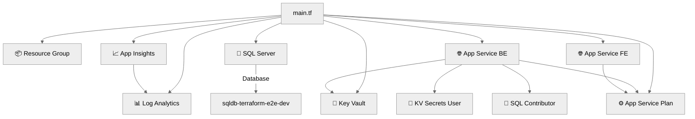

# 💻 Step 5: Implementation Reference - terraform-e2e


<details open>
<summary><strong>📑 Implementation Reference</strong></summary>

- [📁 IaC Templates Location](#-iac-templates-location)
- [🗂️ File Structure](#-file-structure)
- [✅ Validation Status](#-validation-status)
- [🏗️ Resources Created](#-resources-created)
- [🔐 Governance Compliance Mapping](#-governance-compliance-mapping)
- [🚀 Deployment Instructions](#-deployment-instructions)
- [📝 Key Implementation Notes](#-key-implementation-notes)

</details>

> Generated by terraform-code agent | 2025-07-16

| ⬅️ Previous                                    | 📑 Index            | Next ➡️                                              |
| ---------------------------------------------- | ------------------- | ---------------------------------------------------- |
| [04-preflight-check.md](04-preflight-check.md) | [README](README.md) | [06-deployment-summary.md](06-deployment-summary.md) |

## 📁 IaC Templates Location

📁 **Code Location**: [`infra/terraform/terraform-e2e/`](../../infra/terraform/terraform-e2e/)

## 🗂️ File Structure

```text
infra/terraform/terraform-e2e/
├── versions.tf               # Terraform >= 1.9, azurerm ~> 4.0, random ~> 3.0
├── providers.tf              # Provider configuration (features {})
├── backend.tf                # Azure Storage Account backend
├── variables.tf              # All input variable declarations (8 vars)
├── locals.tf                 # unique_suffix, tags, rg_tags, computed values
├── main.tf                   # Resource group + AVM module calls (3-phase)
├── outputs.tf                # Phase-conditional resource outputs
├── bootstrap-backend.sh      # Bash: provision storage account for state
├── bootstrap-backend.ps1     # PowerShell: same
├── deploy.sh                 # Bash deployment script (phase-aware)
└── deploy.ps1                # PowerShell deployment script (phase-aware)
```

## ✅ Validation Status

| Check                | Result | Details                      |
| -------------------- | ------ | ---------------------------- |
| `terraform fmt`      | ✅     | All files formatted          |
| `terraform init`     | ✅     | All providers/modules cached |
| `terraform validate` | ✅     | Configuration is valid       |

## 🏗️ Resources Created

| Resource              | Terraform Type / AVM Module                           | Phase | Naming Pattern                            |
| --------------------- | ----------------------------------------------------- | ----- | ----------------------------------------- |
| Resource Group        | `azurerm_resource_group`                              | 1     | `rg-{project}-{env}`                      |
| Log Analytics         | `Azure/avm-res-operationalinsights-workspace/azurerm` | 1     | `log-{project}-{env}-{suffix}`            |
| Application Insights  | `Azure/avm-res-insights-component/azurerm`            | 1     | `appi-{project}-{env}-{suffix}`           |
| Key Vault             | `Azure/avm-res-keyvault-vault/azurerm`                | 2     | `kv-{short}-{env}-{suffix}` (max 24 char) |
| SQL Server + Database | `Azure/avm-res-sql-server/azurerm`                    | 2     | `sql-{project}-{env}-{suffix}`            |
| App Service Plan      | `Azure/avm-res-web-serverfarm/azurerm`                | 3     | `asp-{project}-{env}`                     |
| App Service (BE)      | `Azure/avm-res-web-site/azurerm`                      | 3     | `app-{project}-{env}-{suffix}`            |
| App Service (FE)      | `Azure/avm-res-web-site/azurerm`                      | 3     | `app-{project}-fe-{env}-{suffix}`         |
| RBAC: KV Secrets User | `azurerm_role_assignment`                             | 3     | BE managed identity → Key Vault           |
| RBAC: SQL Contributor | `azurerm_role_assignment`                             | 3     | BE managed identity → SQL Server          |



## 🔐 Governance Compliance Mapping

### Deny Policies → Terraform Arguments

| Policy                        | Effect | azurePropertyPath                              | Terraform Argument                      | Value Set         |
| ----------------------------- | ------ | ---------------------------------------------- | --------------------------------------- | ----------------- |
| Allowed locations             | Deny   | `location`                                     | `location`                              | `swedencentral`   |
| Allowed locations for RG      | Deny   | `location`                                     | `location`                              | `swedencentral`   |
| Storage: Secure transfer      | Deny   | `properties.supportsHttpsTrafficOnly`          | N/A (state backend only)                | `true`            |
| Storage: No public blob       | Deny   | `properties.allowBlobPublicAccess`             | N/A (state backend only)                | `false`           |
| Storage: TLS 1.2              | Deny   | `properties.minimumTlsVersion`                 | N/A (state backend only)                | `TLS1_2`          |
| Web Apps: HTTPS only          | Deny   | `properties.httpsOnly`                         | `https_only`                            | `true`            |
| Web Apps: TLS 1.2             | Deny   | `properties.siteConfig.minTlsVersion`          | `site_config.minimum_tls_version`       | `"1.3"` (default) |
| SQL: Azure AD only            | Deny   | `properties.administrators.azureADOnlyAuth...` | `azuread_administrator.azuread_auth...` | `true`            |
| App Service: Managed identity | Deny   | `identity.type`                                | `managed_identities.system_assigned`    | `true`            |
| JV-Enforce RG Tags v3         | Deny   | Resource group tags                            | `local.rg_tags` (9 tags)                | All set           |

### Tag Requirements

**Resource Group Tags** (9 lowercase keys — enforced by JV-Enforce RG Tags v3):

```hcl
local.rg_tags = {
  costcenter  = "terraform-e2e"
  dataclass   = "general"
  department  = "engineering"
  environment = var.environment
  managedby   = "Terraform"
  owner       = var.owner
  project     = var.project
  workload    = "terraform-e2e"
  dr          = "non-critical"
}
```

**Resource Tags** (4 PascalCase keys — baseline minimum):

```hcl
local.tags = {
  Environment = var.environment
  ManagedBy   = "Terraform"
  Project     = var.project
  Owner       = var.owner
}
```

## 🚀 Deployment Instructions

<details>
<summary><strong>🔧 Step 0: Bootstrap State Backend</strong></summary>

```bash
cd infra/terraform/terraform-e2e
chmod +x bootstrap-backend.sh
./bootstrap-backend.sh
```

Or PowerShell:

```powershell
cd infra/terraform/terraform-e2e
.\bootstrap-backend.ps1
```

</details>

<details>
<summary><strong>🟢 Quick Deploy (Bash)</strong></summary>

```bash
cd infra/terraform/terraform-e2e
chmod +x deploy.sh
./deploy.sh
```

</details>

<details>
<summary><strong>🟢 Quick Deploy (PowerShell)</strong></summary>

```powershell
cd infra/terraform/terraform-e2e
.\deploy.ps1
```

</details>

<details>
<summary><strong>🔄 Phased Deploy</strong></summary>

```bash
# Phase 1: Foundation (RG, Log Analytics, App Insights)
./deploy.sh -p 1

# Phase 2: Security + Data (Key Vault, SQL Server)
./deploy.sh -p 2

# Phase 3: Compute (App Service Plan, App Services, RBAC)
./deploy.sh -p 3
```

Or PowerShell:

```powershell
.\deploy.ps1 -DeploymentPhase 1
.\deploy.ps1 -DeploymentPhase 2
.\deploy.ps1 -DeploymentPhase 3
```

</details>

<details>
<summary><strong>⚙️ Custom Parameters</strong></summary>

```bash
./deploy.sh \
  -g "rg-terraform-e2e-staging" \
  -l "swedencentral" \
  -e "staging" \
  -p 3
```

</details>

## 📝 Key Implementation Notes

| Note                                                         | Impact             | Reference    |
| ------------------------------------------------------------ | ------------------ | ------------ |
| Unique suffix via `substr(md5(rg.id), 0, 4)` + random_string | All resource names | locals.tf    |
| Phased deployment via `var.deployment_phase` (1-3)           | Progressive deploy | variables.tf |
| RBAC-only Key Vault (no access policies)                     | All secret access  | main.tf      |
| Azure AD-only SQL authentication                             | SQL access control | main.tf      |
| System-assigned managed identity on both App Services        | RBAC assignments   | main.tf      |
| Application Insights via dedicated module parameter          | Telemetry wiring   | main.tf      |

### Unique Suffix Strategy

```hcl
resource "random_string" "suffix" {
  length  = 4
  special = false
  upper   = false
}

locals {
  suffix = random_string.suffix.result
}
```

### Security Baseline

- TLS 1.2+ on all services (App Service defaults to 1.3, SQL hardcoded to 1.2)
- HTTPS-only on all App Services
- No public blob access on storage (bootstrap script)
- Managed identity preferred for all service-to-service auth
- Azure AD-only authentication for SQL Server
- Key Vault with RBAC authorization and purge protection

---

_Implementation reference generated from Terraform configurations._

---

<div align="center">

| ⬅️ [04-preflight-check.md](04-preflight-check.md) | 🏠 [Project Index](README.md) | ➡️ [06-deployment-summary.md](06-deployment-summary.md) |
| ------------------------------------------------- | ----------------------------- | ------------------------------------------------------- |

</div>
