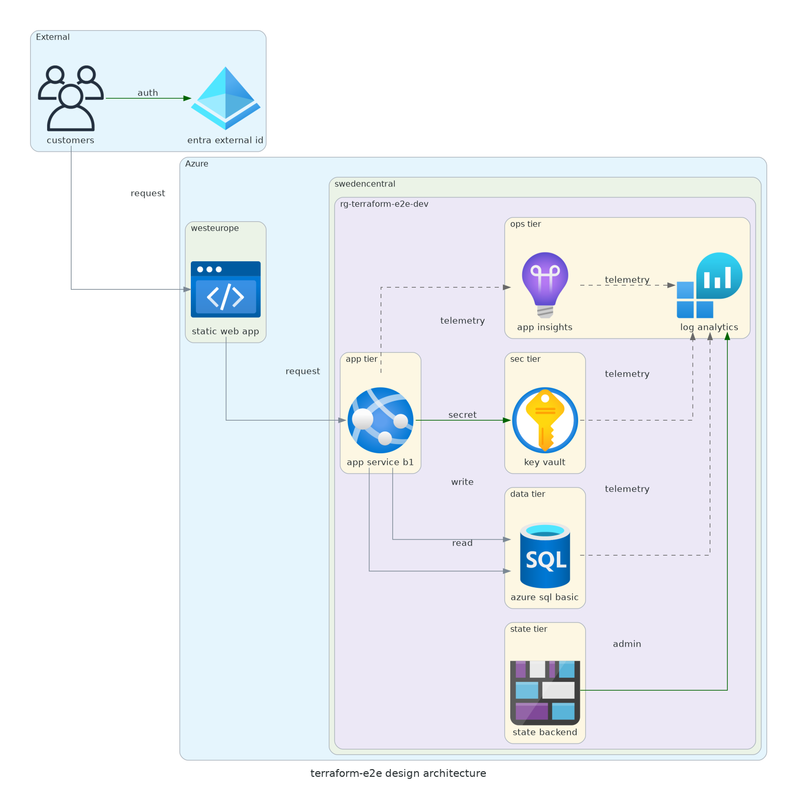

# 📐 Azure Design Document: terraform-e2e

<strong>📑 Design Contents</strong>

- [📝 1. Introduction](#-1-introduction)
- [🏛️ 2. Azure Architecture Overview](#-2-azure-architecture-overview)
- [🌐 3. Networking](#-3-networking)
- [💾 4. Storage](#-4-storage)
- [💻 5. Compute](#-5-compute)
- [👤 6. Identity & Access](#-6-identity--access)
- [🔐 7. Security & Compliance](#-7-security--compliance)
- [🔄 8. Backup & Disaster Recovery](#-8-backup--disaster-recovery)
- [📊 9. Management & Monitoring](#-9-management--monitoring)
- [📎 10. Appendix](#-10-appendix)
- [References](#references)

> Generated by as-built agent | 2026-02-26

| ⬅️ Previous                                            | 📑 Index            | Next ➡️                                              |
| ------------------------------------------------------ | ------------------- | ---------------------------------------------------- |
| [07-documentation-index.md](07-documentation-index.md) | [README](README.md) | [07-operations-runbook.md](07-operations-runbook.md) |

**Version**: 1.0
**Date**: 2026-02-26
**Author**: Generated by As-Built Agent
**Status**: Draft

---

## 📝 1. Introduction

### 1.1 Document Purpose

This design document captures the deployed (as-built) architecture for `terraform-e2e` and provides a technical baseline for operations, governance reviews, and future production hardening.

**Intended Audience:**

- Solution Architects
- Operations/SRE Teams
- Security & Compliance Teams
- Development Teams

### 1.2 Project Overview

`terraform-e2e` is a small ecommerce storefront workload deployed with Terraform using an N-tier pattern.

**Business Objectives:**

- Deliver a low-cost, Azure-hosted ecommerce proof-of-value platform
- Maintain GDPR-friendly EU residency with Azure resources in EU regions
- Keep infrastructure reproducible and policy-compliant through Terraform

### 1.3 Design Objectives

| Objective    | Target | Implementation |
| ------------ | ------ | -------------- |
| Availability | 99.5%+ | PremiumV3 App Service plan (zone redundant), managed PaaS services |
| Performance  | <500ms API p95 (target) | PremiumV3 Linux App Service + Azure SQL Basic |
| Security     | TLS 1.2+, HTTPS only, AAD-only SQL | Key Vault RBAC, HTTPS-only web apps, SQL AAD-only auth |
| Scalability  | Growth path to production | App Service and SQL tier upgrades, DR failover runbooks |

### 1.4 Constraints & Assumptions

**Constraints:**

- Subscription policies enforce location, tags, and baseline security settings
- Current deployment is in a single region (`swedencentral`)

**Assumptions:**

- Current environment is `dev` with controlled traffic and non-production RTO/RPO targets
- Deployment summary and Terraform state outputs are the source of truth for as-built state

### 1.5 Stakeholders

| Role | Team | Responsibility |
| ---- | ---- | -------------- |
| Product Owner | team-terraform | Business prioritization |
| Platform Engineer | team-terraform | IaC lifecycle and deployments |
| Security Reviewer | Shared governance | Policy and control verification |

---

## 🏛️ 2. Azure Architecture Overview

### 2.1 Architecture Diagram

Source: [03-des-diagram.py](./03-des-diagram.py)

### 2.2 Resource Summary

| Category | Count |
| -------- | ----- |
| Compute | 3 |
| Networking | 0 |
| Data | 3 |
| Security | 1 |
| Monitoring/Operations | 3 |
| **Total** | **10** |

### 2.3 As-Built Resource Topology

- Frontend: `app-terraform-e2e-fe-dev-3hpu.azurewebsites.net`
- Backend: `app-terraform-e2e-dev-3hpu.azurewebsites.net`
- Shared compute plan: `asp-terraform-e2e-dev` (`P1v3`, capacity 3, zone redundant)
- Data plane: SQL Server `sql-terraform-e2e-dev-3hpu` + DB `sqldb-terraform-e2e-dev`
- Security plane: Key Vault `kv-tfe2dev-3hpu`
- Observability: App Insights `appi-terraform-e2e-dev-3hpu` + Log Analytics `log-terraform-e2e-dev-3hpu`

---

## 🌐 3. Networking

- App endpoints are Azure App Service default hostnames on HTTPS.
- App Service resources report `publicNetworkAccess = Disabled` in deployed properties.
- Key Vault and SQL server are configured with restrictive defaults at resource level:
  - Key Vault network ACL default action: `Deny`
  - SQL Server `publicNetworkAccess = Disabled`
- Private endpoint resources are not deployed in this environment.

---

## 💾 4. Storage

- Primary transactional store: Azure SQL Database `sqldb-terraform-e2e-dev` on Basic tier.
- SQL backup storage redundancy is `Geo` (as-built properties).
- Point-in-time restore is available for SQL Database service-managed backups.
- Secrets/configuration data is externalized in Key Vault (`kv-tfe2dev-3hpu`).

---

## 💻 5. Compute

- App Service Plan `asp-terraform-e2e-dev` is deployed as Linux `P1v3`.
- Two Linux Web Apps are deployed and running:
  - Backend API: `app-terraform-e2e-dev-3hpu`
  - Frontend site: `app-terraform-e2e-fe-dev-3hpu`
- Both apps use system-assigned managed identity.
- Backend app integrates with Key Vault and Application Insights via app settings.

---

## 👤 6. Identity & Access

- SQL Server uses Azure AD-only authentication (`azureADOnlyAuthentication = true`).
- System-assigned managed identity is enabled on both App Services.
- RBAC assignments from Terraform:
  - Backend app MI → `Key Vault Secrets User` on Key Vault scope
  - Backend app MI → `Contributor` on SQL Server scope
- Resource tagging includes mandatory governance and operational tags.

---

## 🔐 7. Security & Compliance

<strong>🔒 Security Controls</strong>

| Control | Implementation | Evidence |
| ------- | -------------- | -------- |
| TLS 1.2+ | SQL min TLS 1.2; platform TLS for App Service | [06-deployment-summary.md](./06-deployment-summary.md) |
| HTTPS-only | `https_only = true` on both web apps | [06-deployment-summary.md](./06-deployment-summary.md) |
| Managed Identity | System-assigned MI on both web apps | [05-implementation-reference.md](./05-implementation-reference.md) |
| Network posture | SQL PNA disabled; KV ACL default deny | Azure Resource Graph results (2026-02-26) |

<strong>📋 Compliance Mapping</strong>

| Framework | Control ID | Status |
| --------- | ---------- | ------ |
| GDPR (applicable) | Data residency in EU | ✅ |
| Azure Policy Baseline | Required tags and security settings | ✅ |
| Azure SQL hardening | AAD-only authentication | ✅ |

For full control-by-control mapping and gap tracking, see [07-compliance-matrix.md](./07-compliance-matrix.md).

---

## 🔄 8. Backup & Disaster Recovery

- Current deployment runs single-region in `swedencentral`.
- SQL service-managed backup capabilities provide restore options for DB recovery.
- DR strategy is documented as manual regional failover with infrastructure redeployment.
- Recovery objectives and procedures are detailed in [07-backup-dr-plan.md](./07-backup-dr-plan.md).

---

## 📊 9. Management & Monitoring

- Monitoring stack:
  - Application Insights (`appi-terraform-e2e-dev-3hpu`)
  - Log Analytics (`log-terraform-e2e-dev-3hpu`), 30-day retention
  - Smart detector alert rule (`Failure Anomalies`)
- Resource health was validated via deployment summary, Terraform outputs, and Resource Graph query.
- Operational procedures are in [07-operations-runbook.md](./07-operations-runbook.md).

---

## 📎 10. Appendix

📋 Detailed Resource Configuration

- Subscription: `00858ffc-dded-4f0f-8bbf-e17fff0d47d9`
- Resource Group: `rg-terraform-e2e-dev`
- Location: `swedencentral`
- Terraform deployment phase: 3 (full)
- Core outputs and IDs: [06-deployment-summary.md](./06-deployment-summary.md)

📚 Reference Architecture Links

| Architecture | Link |
| ------------ | ---- |
| Runtime flow | [04-runtime-diagram.py](./04-runtime-diagram.py) |
| Dependency graph | [04-dependency-diagram.py](./04-dependency-diagram.py) |

---

## References

| Topic | Link |
| ----- | ---- |
| Well-Architected Framework | [Overview](https://learn.microsoft.com/azure/well-architected/) |
| Azure Architecture Center | [Architectures](https://learn.microsoft.com/azure/architecture/) |
| Security Baseline | [MCSB overview](https://learn.microsoft.com/security/benchmark/azure/overview) |
| Azure SQL security | [AAD-only authentication](https://learn.microsoft.com/azure/azure-sql/database/authentication-aad-configure) |

---

| ⬅️ [07-documentation-index.md](07-documentation-index.md) | 🏠 [Project Index](README.md) | ➡️ [07-operations-runbook.md](07-operations-runbook.md) |
| --------------------------------------------------------- | ----------------------------- | ------------------------------------------------------- |

