# Agent and Skill Workflow

> [Current Version](../VERSION.md) | The 7-step infrastructure development workflow

## Overview

Agentic InfraOps uses a multi-agent orchestration system where specialized AI agents coordinate
through artifact handoffs to transform Azure infrastructure requirements into deployed infrastructure
code. The system supports **dual IaC tracks** — Bicep and Terraform — sharing common requirements,
architecture, and design steps (1-3) then diverging into track-specific planning, code generation,
and deployment (steps 4-6) before converging again for documentation (step 7).

The **InfraOps Conductor** (🎼 Maestro) orchestrates the complete workflow, routing to
Bicep or Terraform agents based on the `iac_tool` field in `01-requirements.md`,
while enforcing mandatory approval gates.

## Agent Architecture

### The Conductor Pattern

```mermaid
%%{init: {'theme':'neutral'}}%%
graph TB
    subgraph "Orchestrator"
        COND["InfraOps Conductor<br/>🎼 Maestro"]
    end

    subgraph "Step 1: Requirements"
        REQ["requirements<br/>📜 Scribe"]
    end

    subgraph "Step 2: Architecture"
        ARCH["architect<br/>🏛️ Oracle"]
        MCP["💰 Azure Pricing MCP"]
    end

    subgraph "Step 3: Design Artifacts"
        DIAG["azure-diagrams<br/>🎨 Skill"]
        ADR["azure-adr<br/>📝 Skill"]
    end

    subgraph "Step 4: Planning"
        BPLAN["bicep-plan<br/>📐 Strategist"]
        TPLAN["terraform-plan<br/>📐 Strategist"]
    end

    subgraph "Step 5: Implementation"
        BCODE["bicep-code<br/>⚒️ Forge"]
        BLINT["bicep-lint-subagent"]
        BWHATIF["bicep-whatif-subagent"]
        BREVIEW["bicep-review-subagent"]
        TCODE["terraform-code<br/>⚒️ Forge"]
        TLINT["terraform-lint-subagent"]
        TPLANSA["terraform-plan-subagent"]
        TREVIEW["terraform-review-subagent"]
    end

    subgraph "Step 6: Deployment"
        BDEP["bicep-deploy<br/>🚀 Envoy"]
        TDEP["terraform-deploy<br/>🚀 Envoy"]
    end

    subgraph "Step 7: Documentation"
        DOCS["azure-artifacts<br/>📚 Skill"]
    end

    COND -->|"delegates"| REQ
    COND -->|"delegates"| ARCH
    COND -->|"invokes"| DIAG
    COND -->|"invokes"| ADR
    COND -->|"Bicep track"| BPLAN
    COND -->|"Terraform track"| TPLAN
    COND -->|"Bicep track"| BCODE
    COND -->|"Terraform track"| TCODE
    BCODE -->|"validates"| BLINT
    BCODE -->|"validates"| BWHATIF
    BCODE -->|"validates"| BREVIEW
    TCODE -->|"validates"| TLINT
    TCODE -->|"validates"| TPLANSA
    TCODE -->|"validates"| TREVIEW
    COND -->|"Bicep track"| BDEP
    COND -->|"Terraform track"| TDEP
    COND -->|"invokes"| DOCS

    MCP -.->|"pricing data"| ARCH

    style COND fill:#8957E5,color:#fff
    style REQ fill:#e1f5fe
    style ARCH fill:#fff3e0
    style MCP fill:#fff9c4
    style DIAG fill:#f3e5f5
    style ADR fill:#e8eaf6
    style BPLAN fill:#e8f5e9
    style TPLAN fill:#e8f5e9
    style BCODE fill:#fce4ec
    style TCODE fill:#fce4ec
    style BDEP fill:#c8e6c9
    style TDEP fill:#c8e6c9
    style DOCS fill:#e3f2fd
```



---

## Agent Roster

### Primary Orchestrator

| Agent                  | Persona    | Role                                    | Model           |
| ---------------------- | ---------- | --------------------------------------- | --------------- |
| **InfraOps Conductor** | 🎼 Maestro | Master orchestrator for 7-step workflow | Claude Opus 4.6 |

### Core Agents (7 Steps)

Steps 1-3 and 7 are shared. Steps 4-6 have Bicep and Terraform variants.

| Step | Agent              | Persona       | Role                                 | Artifact                                             |
| ---- | ------------------ | ------------- | ------------------------------------ | ---------------------------------------------------- |
| 1    | `requirements`     | 📜 Scribe     | Captures infrastructure requirements | `01-requirements.md`                                 |
| 2    | `architect`        | 🏛️ Oracle     | WAF assessment and design decisions  | `02-architecture-assessment.md`                      |
| 3    | `design`           | 🎨 Artisan    | Diagrams and ADRs                    | `03-des-*.md/.py/.png`                               |
| 4b   | `bicep-plan`       | 📐 Strategist | Bicep implementation planning        | `04-implementation-plan.md` + `04-*-diagram.py/.png` |
| 4t   | `terraform-plan`   | 📐 Strategist | Terraform implementation planning    | `04-implementation-plan.md` + `04-*-diagram.py/.png` |
| 5b   | `bicep-code`       | ⚒️ Forge      | Bicep template generation            | `infra/bicep/{project}/`                             |
| 5t   | `terraform-code`   | ⚒️ Forge      | Terraform configuration generation   | `infra/terraform/{project}/`                         |
| 6b   | `bicep-deploy`     | 🚀 Envoy      | Bicep deployment                     | `06-deployment-summary.md`                           |
| 6t   | `terraform-deploy` | 🚀 Envoy      | Terraform deployment                 | `06-deployment-summary.md`                           |
| 7    | —                  | —             | Documentation (via skills)           | `07-*.md`                                            |

### Validation Subagents

**Bicep track:**

| Subagent                | Purpose                                         | Invoked By                   |
| ----------------------- | ----------------------------------------------- | ---------------------------- |
| `bicep-lint-subagent`   | Syntax validation (`bicep lint`, `bicep build`) | `bicep-code`                 |
| `bicep-whatif-subagent` | Deployment preview (`az deployment what-if`)    | `bicep-code`, `bicep-deploy` |
| `bicep-review-subagent` | Code review (AVM, security, naming)             | `bicep-code`                 |

**Terraform track:**

| Subagent                    | Purpose                                         | Invoked By       |
| --------------------------- | ----------------------------------------------- | ---------------- |
| `terraform-lint-subagent`   | Syntax validation (`terraform validate`, `fmt`) | `terraform-code` |
| `terraform-plan-subagent`   | Deployment preview (`terraform plan`)           | `terraform-code` |
| `terraform-review-subagent` | Code review (AVM-TF, security, naming)          | `terraform-code` |

### Standalone Agents

| Agent        | Persona       | Role                                                                    |
| ------------ | ------------- | ----------------------------------------------------------------------- |
| `challenger` | ⚔️ Challenger | Adversarial reviewer — challenges requirements, architecture, and plans |
| `diagnose`   | 🔍 Sentinel   | Resource health assessment and troubleshooting                          |

---

## Approval Gates

The Conductor enforces mandatory pause points for human oversight:

| Gate       | After Step            | User Action                         |
| ---------- | --------------------- | ----------------------------------- |
| **Gate 1** | Requirements (Step 1) | Confirm requirements complete       |
| **Gate 2** | Architecture (Step 2) | Approve WAF assessment              |
| **Gate 3** | Planning (Step 4)     | Approve implementation plan         |
| **Gate 4** | Pre-Deploy (Step 5)   | Approve lint/what-if/review results |
| **Gate 5** | Post-Deploy (Step 6)  | Verify deployment                   |

---

## Workflow Steps

### Step 1: Requirements (📜 Scribe)

**Agent**: `requirements`

Gather infrastructure requirements through interactive conversation.

```text
Invoke: Ctrl+Shift+A → requirements
Output: agent-output/{project}/01-requirements.md
```

**Captures**:

- Functional requirements (what the system does)
- Non-functional requirements (performance, availability, security)
- Compliance requirements (regulatory, organizational)
- Budget constraints

**Handoff**: Passes context to `architect` agent.

---

### Step 2: Architecture (🏛️ Oracle)

**Agent**: `architect`

Evaluate requirements against Azure Well-Architected Framework pillars.

```text
Invoke: Ctrl+Shift+A → architect
Output: agent-output/{project}/02-architecture-assessment.md
```

**Features**:

- WAF pillar scoring (Reliability, Security, Cost, Operations, Performance)
- SKU recommendations with real-time pricing (via Azure Pricing MCP)
- Architecture decisions with rationale
- Risk identification and mitigation

**Handoff**: Suggests `azure-diagrams` skill or IaC planning agent (`bicep-plan` / `terraform-plan`).

---

### Step 3: Design Artifacts (🎨 Artisan | Optional)

**Skills**: `azure-diagrams`, `azure-adr`

Create visual and textual design documentation.

```text
Trigger: "Create an architecture diagram for {project}"
Output: agent-output/{project}/03-des-diagram.py, 03-des-adr-*.md
```

**Diagram types**: Azure architecture, business flows, ERD, timelines

**ADR content**: Decision, context, alternatives, consequences

---

### Step 4: Planning (📐 Strategist)

**Agent**: `bicep-plan` (Bicep track) or `terraform-plan` (Terraform track)

Create detailed implementation plan with governance discovery.

```text
Bicep:     Ctrl+Shift+A → bicep-plan
Terraform: Ctrl+Shift+A → terraform-plan
Output:    agent-output/{project}/04-implementation-plan.md, 04-governance-constraints.md
```

**Features**:

- Azure Policy compliance discovery (governance-discovery-subagent produces both
  `bicepPropertyPath` and `azurePropertyPath` for dual-track consumption)
- AVM module selection (Bicep: `br/public:avm/res/`, Terraform: AVM-TF registry)
- Resource dependency mapping
- Auto-generated Step 4 diagrams (`04-dependency-diagram.py/.png` and `04-runtime-diagram.py/.png`)
- Naming convention validation (CAF)
- Phased implementation approach

**Gate**: User approves the implementation plan before proceeding.

---

### Step 5: Implementation (⚒️ Forge)

**Agent**: `bicep-code` (Bicep track) or `terraform-code` (Terraform track)

Generate IaC templates following Azure Verified Modules standards.

```text
Bicep:     Ctrl+Shift+A → bicep-code
           Output: infra/bicep/{project}/main.bicep, modules/

Terraform: Ctrl+Shift+A → terraform-code
           Output: infra/terraform/{project}/main.tf, modules/

Both:      agent-output/{project}/05-implementation-reference.md
```

**Standards** (shared across both tracks):

- AVM-first approach (Bicep: public registry; Terraform: AVM-TF registry)
- Unique suffix for global resource names
- Required tags on all resources
- Security defaults (TLS 1.2, HTTPS-only, managed identity)
- Phase 1.5 governance compliance mapping from `04-governance-constraints.json`

**Preflight Validation** (via track-specific subagents):

| Bicep Subagent          | Terraform Subagent          | Validation                    |
| ----------------------- | --------------------------- | ----------------------------- |
| `bicep-lint-subagent`   | `terraform-lint-subagent`   | Syntax check, linting rules   |
| `bicep-whatif-subagent` | `terraform-plan-subagent`   | Deployment preview            |
| `bicep-review-subagent` | `terraform-review-subagent` | AVM compliance, security scan |

**Gate**: User approves preflight validation results.

---

### Step 6: Deployment (🚀 Envoy)

**Agent**: `bicep-deploy` (Bicep track) or `terraform-deploy` (Terraform track)

Execute Azure deployment with preflight validation.

```text
Bicep:     Ctrl+Shift+A → bicep-deploy
Terraform: Ctrl+Shift+A → terraform-deploy
Output:    agent-output/{project}/06-deployment-summary.md
```

**Bicep features**:

- `bicep build` validation
- `az deployment group what-if` analysis
- Deployment execution via `deploy.ps1`
- Post-deployment resource verification

**Terraform features**:

- `terraform validate` and `terraform fmt -check`
- `terraform plan` preview
- Phase-aware deployment via `bootstrap.sh` and `deploy.sh`
- Post-deployment resource verification

**Gate**: User verifies deployed resources.

---

### Step 7: Documentation (📚 Skills)

**Skill**: `azure-artifacts`

Generate comprehensive workload documentation.

```text
Trigger: "Generate documentation for {project}"
Output: agent-output/{project}/07-*.md
```

**Document Suite**:

| File                        | Purpose                        |
| --------------------------- | ------------------------------ |
| `07-documentation-index.md` | Master index with links        |
| `07-design-document.md`     | Technical design documentation |
| `07-operations-runbook.md`  | Day-2 operational procedures   |
| `07-resource-inventory.md`  | Complete resource listing      |
| `07-ab-cost-estimate.md`    | As-built cost analysis         |
| `07-compliance-matrix.md`   | Security control mapping       |
| `07-backup-dr-plan.md`      | Disaster recovery procedures   |

---

## Agents vs Skills

| Aspect          | Agents                                   | Skills                   |
| --------------- | ---------------------------------------- | ------------------------ |
| **Invocation**  | Manual (`Ctrl+Shift+A`) or via Conductor | Automatic or explicit    |
| **Interaction** | Conversational with handoffs             | Task-focused             |
| **State**       | Session context                          | Stateless                |
| **Output**      | Multiple artifacts                       | Specific outputs         |
| **When to use** | Core workflow steps                      | Specialized capabilities |

---

## Quick Reference

### Using the Conductor (Recommended)

```text
1. Ctrl+Shift+I → Select "InfraOps Conductor"
2. Describe your infrastructure project
3. Follow guided workflow through all 7 steps with approval gates
```

### Direct Agent Invocation

```text
1. Ctrl+Shift+A → Select specific agent
2. Provide context for that step
3. Agent produces artifacts and suggests next step
```

### Skill Invocation

**Automatic**: Skills activate based on prompt keywords:

```text
"Create an architecture diagram" → azure-diagrams skill
"Document the decision to use AKS" → azure-adr skill
```

**Explicit**: Reference the skill by name:

```text
"Use the azure-artifacts skill to generate documentation"
```

---

## Artifact Naming Convention

| Step           | Prefix    | Example                                                     |
| -------------- | --------- | ----------------------------------------------------------- |
| Requirements   | `01-`     | `01-requirements.md`                                        |
| Architecture   | `02-`     | `02-architecture-assessment.md`                             |
| Design         | `03-des-` | `03-des-diagram.py`, `03-des-adr-0001-*.md`                 |
| Planning       | `04-`     | `04-implementation-plan.md`, `04-governance-constraints.md` |
| Implementation | `05-`     | `05-implementation-reference.md`                            |
| Deployment     | `06-`     | `06-deployment-summary.md`                                  |
| As-Built       | `07-`     | `07-design-document.md`, `07-ab-diagram.py`                 |
| Diagnostics    | `08-`     | `08-resource-health-report.md`                              |

---

## Next Steps

- [Prompt Guide](prompt-guide/) — ready-to-use prompts for every agent and skill
- [Quickstart](quickstart.md) — 10-minute getting started walkthrough
